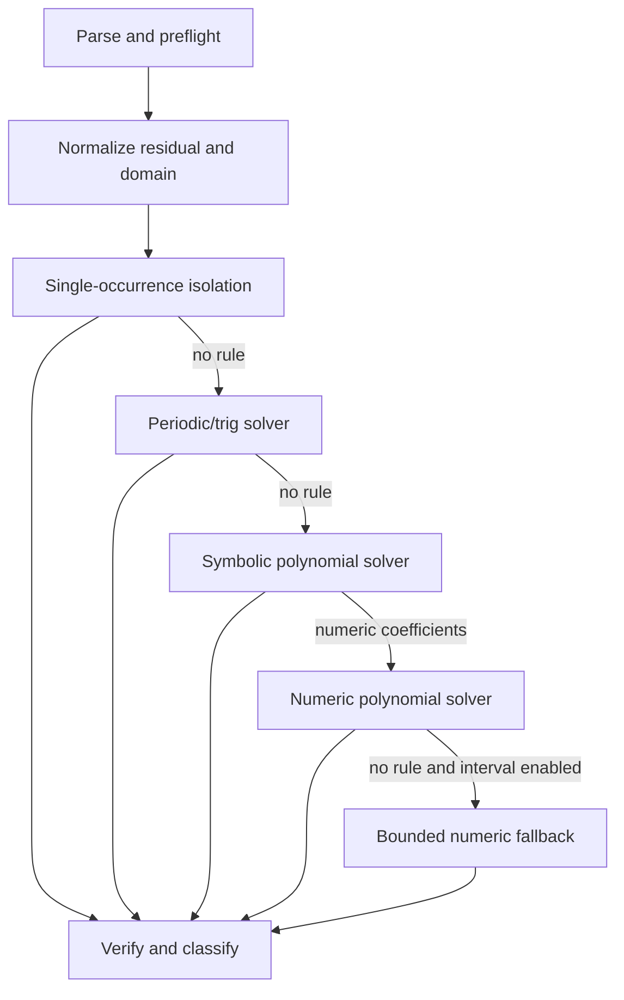

# Advanced equation-solving implementation plan

Status: proposed  
Baseline: `symbolicjs@0.1.0`, repository commit `cfa54e196e070a80060ab0821c87a04400e3d9ba`  
Target runtime: MathJS `>=15.2.0 <16`, Node.js `>=22`  

## 1. Purpose

This plan expands SymbolicJS from its current real-scalar equation solver into a
bounded, explainable solver for the remaining equation classes needed to replace
Nerdamer in Spoke:

- complete real solution families for circular trigonometric equations;
- conservative normalization of common compound trigonometric equations;
- symbolic real cubic and quartic polynomials;
- numeric polynomials above degree three, with a tested path through degree 100;
- bounded numeric solutions for otherwise unsupported real transcendental equations;
- finite complex algebraic solutions when the caller explicitly requests the
  complex domain.

The plan builds on the existing `EqualityNode`, `=:=` parser, condition model,
verification kernel, safety budgets, typed solver results, polynomial extractor,
and solve-for-all orchestration. It does not replace MathJS expression nodes or
introduce a second symbolic expression system.

## 2. Definition of the target

“Handle” means more than returning a plausible value. For every accepted input,
the public solver must do exactly one of the following:

1. return a complete finite or parametric solution set for the declared domain;
2. return solutions complete within an explicit finite interval;
3. return a typed partial result that identifies the unsearched remainder;
4. return a typed unsupported or resource-limit result.

The solver must never present a principal inverse-trigonometric value as the full
real solution set, cross an undefined point during numeric search, discard a
symbolic coefficient condition, or call a sampled result a proof.

### In scope

- Real, scalar, univariate equations.
- Target-free symbolic coefficients and the conditions under which formulas hold.
- `sin`, `cos`, `tan`, `sec`, `csc`, and `cot`, plus inverse circular functions.
- Common same-argument and same-frequency trigonometric reductions.
- Exact or conditional formulas for polynomial degrees one through four.
- Numeric roots for real-coefficient univariate polynomials above degree three.
- Numeric real-root search over an explicitly supplied finite interval.
- Complex finite polynomial roots behind `domain: 'complex'`.
- Deterministic diagnostics, serialization, resource limits, and packed-package tests.

### Explicitly out of scope

- General multivariate polynomial systems or Gröbner bases.
- Differential, integral, recurrence, or matrix equations.
- General symbolic solutions involving Lambert W, elliptic functions, or special
  functions not provided by MathJS.
- Proof of completeness for unrestricted numeric searches on the whole real line.
- Complex parametric solution families for transcendental functions.
- A general-purpose identity theorem prover or an unrestricted rewrite engine.
- Runtime dependence on Nerdamer.

These boundaries are public contract, not temporary silent failures. Unsupported
inputs must keep returning typed outcomes.

## 3. Architectural rules

1. **MathJS-native trees.** Every equation side, coefficient, condition, and
   returned value remains a MathJS `MathNode` created by the installed instance.
2. **Domain is explicit.** The default remains the real domain. Complex behavior
   is opt-in and interval behavior is meaningful only in the real domain.
3. **Completeness is explicit.** Finite, parametric, interval-complete, and partial
   results are distinguishable in the type system.
4. **Conditions are first-class.** Division, roots, inverse functions, leading
   coefficients, and symbolic discriminants add conditions before candidates are
   admitted.
5. **Construction is verified.** Symbolic formulas use derivation-specific
   certificates; numeric answers use scale-aware residuals and, when possible,
   certified brackets.
6. **Rewrites terminate.** Every normalizer has a canonical direction, decreasing
   cost, visited-state detection, and the existing rewrite/work budgets.
7. **Algorithms are bounded.** New degree, function-evaluation, subdivision,
   family, expression-size, and root-polishing work consumes solver budgets.
8. **Results are deterministic.** Equivalent inputs produce stable ordering,
   canonical parameter names, normalized conditions, and reproducible diagnostics.
9. **No hidden fallback.** Numeric search runs only when the public options permit
   it and, for general functions, only over an explicit interval.
10. **No Nerdamer coupling.** Nerdamer may be a pinned development-time comparison
    oracle. It is never imported by production code or shipped in the tarball.

## 4. Proposed result and option contracts

Chapter 1 owns the final API names. The following shape is the design target and
may change only before that chapter's API tests are committed.

```ts
type ScalarDomain = 'real' | 'complex';

interface RealInterval {
  readonly lower: number;
  readonly upper: number;
  readonly includeLower?: boolean; // default true
  readonly includeUpper?: boolean; // default true
}

interface IntegerParameter {
  readonly name: string;
  readonly domain: 'integer';
}

interface ParametricFamily {
  readonly value: MathNode;
  readonly parameters: readonly IntegerParameter[];
  readonly conditions: readonly Condition[];
  readonly exact: true;
  readonly verification: VerificationResult;
}

interface ParametricSolutions {
  readonly kind: 'parametric';
  readonly target: string;
  readonly domain: 'real';
  readonly families: readonly ParametricFamily[];
  readonly completeness: 'complete';
  readonly diagnostics?: SolveDiagnostics;
}

interface SearchScope {
  readonly domain: ScalarDomain;
  readonly interval?: RealInterval;
  readonly completeness: 'complete' | 'complete-in-interval' | 'partial';
}

interface SolveOptions {
  readonly domain?: ScalarDomain;       // default 'real'
  readonly interval?: RealInterval;     // real domain only
  readonly numericFallback?: boolean;   // default false for general functions
  readonly tolerance?: number;
  readonly limits?: Partial<SolverLimits>;
  readonly diagnostics?: boolean;
}
```

The existing result kinds remain. Additions required by this plan are:

- a `parametric` result kind;
- search-scope/completeness metadata on results produced by numeric search;
- optional finite-solution multiplicity metadata for polynomial diagnostics;
- `families` on a partial result when some periodic families are known;
- new unsupported reasons such as `interval-required`, `unsupported-domain`,
  `unsupported-trig-form`, `numeric-search-incomplete`, and
  `symbolic-expression-limit`;
- new limit kinds for function evaluations, interval subdivisions, parametric
  families, symbolic expression nodes, and numeric polynomial degree;
- optional verification evidence describing `symbolic`, `bracket`, `residual`, or
  `sample` methods without weakening the existing `proven`, `rejected`, and
  `inconclusive` statuses.

Adding a new discriminant to `SolveResult` breaks exhaustive TypeScript switches.
It therefore ships at a documented minor-version boundary (`0.2.0` while the
package is pre-1.0), with a migration example for consumers.

## 5. Target dispatch pipeline



Every stage accepts and returns immutable data. “No rule” advances to the next
stage; a contradiction, a complete result, or a resource limit stops dispatch.
Partial results advance only when the next stage is designed to merge them.

## 6. Upstream algorithm adaptation and provenance

Nerdamer is useful reference material, not the architecture. The upstream source
currently contains:

- cubic and quartic formula construction in
  [`Solve.js`](https://github.com/jiggzson/nerdamer/blob/4c0ab018848b80fd7627de4eaa6be0a590019353/Solve.js);
- high-degree numeric polynomial roots in
  [`Algebra.js`](https://github.com/jiggzson/nerdamer/blob/4c0ab018848b80fd7627de4eaa6be0a590019353/Algebra.js), including a Jenkins–Traub port;
- point generation, bisection, and Newton iteration in `Solve.js`;
- an MIT license carrying the copyright notice “Copyright (c) 2015 Martin Donk.”

The implementation policy is:

1. Pin every consulted upstream revision in `docs/algorithm-sources.md`.
2. Prefer mathematical reimplementation against MathJS nodes when the upstream
   routine is tightly coupled to Nerdamer's parser, `Symbol`, algebra, or calculus
   internals.
3. If code structure or substantial code is translated, add a source-file header
   and `THIRD_PARTY_NOTICES.md` containing the required copyright and permission
   notice.
4. Audit nested provenance before copying. Nerdamer describes its Jenkins–Traub
   section as a verbatim copy of a David Binner port; direct translation is blocked
   until that port's license and attribution requirements are recorded. If they
   cannot be established, independently implement the published algorithm or use
   another permissively licensed implementation.
5. Keep Nerdamer, if used, pinned in development dependencies only and exclude it
   from `files`, runtime imports, bundles, and packed-package smoke tests.
6. Treat differential results as leads, not truth. Every accepted solution must
   also pass independent substitution, domain, and completeness checks.

## 7. Chapter execution policy

Each chapter is an independently reviewable implementation unit and one atomic
commit. Work for a chapter may use temporary local commits, but the shared branch
receives the chapter only after its full gate passes.

For every chapter:

1. Add the chapter's tests and fixtures first.
2. Implement only enough production behavior to satisfy the declared scope.
3. Run the new focused tests during development.
4. Run the complete repository gate before committing:

   ```sh
   npm run check
   ```

5. Confirm no test is skipped, marked todo, weakened, or changed merely to accept
   incorrect behavior.
6. Confirm inputs remain unmodified, outputs remain frozen, and limits fail with a
   typed result.
7. Commit exactly that chapter. Do not combine the next chapter's scaffolding.

Documentation-only changes may accompany the chapter whose behavior they describe.
No chapter is complete based solely on matching Nerdamer output.

## 8. Chapter plan

### Chapter 0 — Baseline, provenance, and acceptance harness

**Goal:** Freeze the starting behavior and create a trustworthy test framework for
adapted algorithms before changing public solver semantics.

**Deliverables**

- Record the SymbolicJS and MathJS baseline versions.
- Add `docs/algorithm-sources.md` with pinned source revisions, algorithm names,
  license decisions, and a copied-versus-reimplemented field.
- Add `THIRD_PARTY_NOTICES.md` only if the first chapter copies or translates
  protected implementation expression; otherwise add it in the chapter that does.
- Create a fixture schema containing equation, target, domain, optional interval,
  expected result class, expected roots/families, conditions, and provenance.
- Add helpers for scale-aware residual measurement, complex distance, family
  instantiation, root-set comparison, and deterministic seeded generation.
- Separate authoritative fixtures from Nerdamer differential fixtures.
- Capture the existing 0.1.0 public behavior so later failures identify intentional
  API changes rather than accidental regressions.

**Required tests**

- The current 203-test suite passes unchanged.
- Fixture loader rejects malformed equations, duplicate fixture IDs, non-finite
  tolerances, and unknown domains.
- Root-set comparison is order independent but preserves multiplicity when asked.
- Residual checks scale by coefficient/expression magnitude and reject NaN/Infinity.
- Seeded generators reproduce byte-identical fixture sequences.
- A pack inspection proves no Nerdamer production dependency or source is shipped.
- License test verifies every adapted source file named in the provenance manifest
  has the required notice.

**Exit gate**

`npm run check` passes on the untouched solver plus the new harness, and the
provenance review either authorizes or explicitly blocks each proposed code port.

**Estimated human engineering effort:** 3–5 hours.

### Chapter 1 — Domains, intervals, and solution-set contracts

**Goal:** Introduce the types needed to represent every later answer without
pretending infinite or interval-limited results are ordinary finite solutions.

**Deliverables**

- Add `ScalarDomain`, validated `RealInterval`, `SearchScope`,
  `IntegerParameter`, `ParametricFamily`, and `ParametricSolutions`.
- Extend `SolveOptions` with `domain`, `interval`, and explicit numeric-fallback
  control. Preserve current defaults: real domain, no general numeric fallback.
- Add the new reason and limit codes listed in section 4.
- Define interval endpoint semantics once, including `-0`, infinities, reversed
  bounds, and open/closed endpoints. Initial public intervals must be finite.
- Add an optional `multiplicity` field without changing solution-set deduplication.
- Freeze and deterministically order all new result objects.
- Document the exhaustive-switch migration required by the `parametric` kind.

**Required tests**

- Compile-time exhaustiveness tests cover every `SolveResult` kind.
- Existing callers that do not use new options retain their prior runtime output.
- Invalid domains, complex intervals, infinite bounds, reversed bounds, invalid
  endpoint flags, and non-finite tolerances fail at the public boundary.
- New nested arrays and records are frozen; mutation attempts do not alter results.
- JSON-safe metadata round-trips while MathJS nodes retain their existing node
  serialization behavior.
- Diagnostics distinguish complete, complete-in-interval, and partial searches.
- Public declarations from the packed tarball match source declarations.

**Exit gate**

All result shapes can be consumed without `any`, the API migration is documented,
and no existing equation changes mathematical meaning.

**Estimated human engineering effort:** 4–7 hours.

### Chapter 2 — Parametric families, canonicalization, and materialization

**Goal:** Build and validate infinite integer-parameter solution families before
introducing trigonometric solving rules.

**Deliverables**

- Add a hygienic parameter allocator using deterministic names such as `_k0` and
  avoiding every symbol already present in the equation or coefficient scope.
- Canonicalize alpha-equivalent families so `a + 2*pi*k` and a renamed equivalent
  deduplicate without conflating different periods.
- Add `instantiateFamily(family, integerAssignments)`.
- Add `materializeSolutions(result, interval, scope?)` for families affine in one
  integer parameter. Derive integer bounds analytically; do not enumerate an
  unbounded range.
- Reject missing, extra, non-integer, unsafe, or non-finite parameter assignments.
- Extend verification with a periodic-family certificate that records the inverse
  identity, period, inner affine transform, and domain conditions used.
- Numeric sampling may falsify a family but may not upgrade it to `proven`.

**Required tests**

- Parameter names never capture equation symbols named `_k0`, `_k1`, or `k`.
- Alpha-equivalent families deduplicate; distinct offsets or periods do not.
- Instantiation accepts negative, zero, and positive safe integers and rejects all
  other assignments.
- Interval materialization handles positive and negative period slopes, open and
  closed endpoints, a single-point interval, no hits, and endpoint roots.
- Materialization returns sorted unique finite solutions and respects candidate and
  total-work budgets.
- A synthetic invalid family is rejected by symbolic substitution.
- Very large intervals hit a typed limit instead of allocating an enormous array.
- Property tests compare analytic integer bounds with bounded brute-force results.

**Exit gate**

The package can safely represent, verify, instantiate, canonicalize, and bound an
infinite family without any trigonometric-specific production rule.

**Estimated human engineering effort:** 5–8 hours.

### Chapter 3 — Isolated circular and inverse-trigonometric equations

**Goal:** Solve complete real families when a supported circular function contains
one affine occurrence of the target.

**Deliverables**

- Add a function registry describing inverse, period, parity, principal range, and
  real input/output conditions for `sin`, `cos`, `tan`, `sec`, `csc`, and `cot`.
- Recognize an affine inner expression `a*x + b` using the polynomial extractor,
  with the condition `a != 0` when `a` is symbolic.
- Implement canonical real families in radians:
  - `sin(u) = y`: `u = asin(y) + 2*pi*k` and
    `u = pi - asin(y) + 2*pi*k`;
  - `cos(u) = y`: `u = acos(y) + 2*pi*k` and
    `u = -acos(y) + 2*pi*k`;
  - `tan(u) = y`: `u = atan(y) + pi*k`;
  - reciprocal functions reduce to the three primary functions with nonzero and
    range conditions.
- Add `1 - y^2 >= 0` for symbolic sine/cosine range checks and corresponding
  reciprocal-function conditions.
- Collapse special-value duplicates (`sin(u)=0`, `cos(u)=1`, and similar) into the
  smallest canonical family set.
- Invert `asin`, `acos`, and `atan` only with their principal-range conditions.
- Add diagnostics naming the matched function, period, branch, and affine transform.

**Required tests**

- Exact family tests for `sin(x)=0`, `sin(x)=1/2`, `cos(2*x+1)=a`,
  `tan(3-x)=b`, `sec(x)=2`, `csc(x)=-2`, and `cot(x)=0`.
- Symbolic right sides retain range and denominator conditions.
- Out-of-range numeric right sides return contradiction, not unsupported.
- `asin(x)=a`, `acos(x)=a`, and `atan(x)=a` enforce their principal ranges.
- Non-affine inner arguments such as `sin(x^2)` return typed unsupported unless an
  earlier isolation rule can soundly transform them.
- Families materialized over `[-2*pi, 2*pi]` match independently enumerated roots.
- Every emitted family passes its symbolic certificate and numeric spot checks for
  at least five integer parameter values.
- Period, family, branch, recursion, and total-work limits are enforced.
- Property tests generate affine inner functions and reconstruct the original
  equation at random valid parameter values.

**Exit gate**

Supported isolated circular equations return all real families, never only the
principal inverse, and every family is either proven by construction or excluded.

**Estimated human engineering effort:** 6–10 hours.

### Chapter 4 — Conservative compound-trigonometric normalization

**Goal:** Reduce common multi-occurrence trigonometric equations to the isolated
solver while keeping rewrite scope finite and auditable.

**Deliverables**

- Add a dedicated trig normalizer with canonical rules for parity, reciprocal
  functions, `sin(u)^2 + cos(u)^2`, double-angle products, and constant-angle
  shifts used by the supported solver paths.
- Require every rewrite to reduce a documented structural cost tuple. Track visited
  canonical keys to prevent cycles.
- Solve same-argument linear combinations
  `A*sin(u) + B*cos(u) = C` by the amplitude-phase transform
  `R*sin(u + phi) = C`, where `R = sqrt(A^2+B^2)` and
  `phi = atan2(B,A)`, retaining `R > 0` and range conditions.
- Detect a polynomial in one trig atom, solve the auxiliary variable with the
  existing polynomial engine, apply `[-1,1]` range conditions where needed, and
  lift each auxiliary root back to parametric families.
- Support bounded forms such as `sin(u)^2 = c`, `cos(u)^2 = c`,
  `sin(u)*cos(u) = c`, and equations reducible by one Pythagorean substitution.
- Merge and alpha-deduplicate families after every lifted branch.
- Return `unsupported-trig-form` for mixed frequencies or identities outside the
  declared table; do not invoke an unrestricted simplifier loop.

**Required tests**

- `sin(x)=cos(x)`, `2*sin(x)+2*cos(x)=1`, `sin(x)^2=1/4`,
  `sin(x)^2+cos(x)^2=1`, `sin(x)*cos(x)=0`, and
  `2*sin(x)^2-3*sin(x)+1=0` have expected classifications and families.
- Symbolic amplitude coefficients produce conditions for the zero-amplitude and
  nonzero-amplitude cases without dividing by an unchecked expression.
- Identities return `identity`; impossible range cases return `contradiction`.
- Reordered and sign-flipped equivalent equations produce canonical-equivalent
  families.
- Known rewrite-cycle inputs terminate within a fixed step count.
- Mixed-frequency examples such as `sin(x)+sin(sqrt(2)*x)=0` remain unsupported.
- Random identities transformed forward and backward preserve numeric evaluation
  across valid domains.
- Expression size, rewrite-step, family, branch, and total-work limits return their
  exact typed limit kinds.

**Exit gate**

Every documented compound form either reduces to a previously proven solver or
returns a precise non-success result; normalization cannot loop or grow without a
budget charge.

**Estimated human engineering effort:** 8–14 hours.

### Chapter 5 — Symbolic real cubic polynomials

**Goal:** Replace the current `symbolic-cubic` gap with condition-aware exact real
solutions while retaining the existing numeric cubic path.

**Deliverables**

- Reuse target-relative coefficient extraction; do not convert formulas through
  source strings.
- Handle `a = 0` by dispatching to the quadratic solver and `a != 0` by explicit
  condition when the leading coefficient is symbolic.
- Try exact factorization and rational roots before Cardano reduction.
- Convert to a depressed cubic and classify by its discriminant.
- For one-real-root cases use MathJS `nthRoot(value, 3)` or an equivalent real cube
  root, never `value^(1/3)` with ambiguous negative/complex semantics.
- For the three-real-root casus irreducibilis, emit the exact trigonometric form in
  the real domain rather than relying on cancellation of complex cube roots.
- Represent symbolic discriminant branches as conditional solutions and preserve
  completeness across mutually exclusive sign conditions.
- Add a cubic construction certificate that verifies the coefficient transform and
  root formula independently of `simplify()` recognizing the final identity.
- Keep numeric cubic as the preferred compact output when every coefficient is
  numeric and the caller has not requested exact form.

**Nerdamer adaptation boundary**

The formula layout in pinned `Solve.js` may guide node construction, but its
string-parsing and root-of-unity approach must not be copied mechanically. The
SymbolicJS implementation must preserve real cube-root semantics, conditions, and
candidate verification.

**Required tests**

- Distinct, repeated, triple, one-real-root, and three-real-root numeric cubics.
- `x^3-6*x^2+11*x-6=0`, `x^3+x+1=0`, `x^3-3*x+1=0`,
  `(x-a)^3=0`, and a general target-free symbolic coefficient fixture.
- Leading-coefficient-zero cases agree exactly with the quadratic solver.
- Scaling the equation by a nonzero constant does not change the root set.
- Exact-factor-first cases remain compact and do not expand into Cardano radicals.
- Returned symbolic candidates substitute to zero under valid sampled coefficient
  scopes and fail under deliberately violated conditions.
- Property tests generate cubics from three known rational roots and compare sets.
- Differential fixtures compare supported cases with Nerdamer but independently
  verify every root and document intentional representation differences.
- Expression-node, branch, candidate, and total-work limits cover formula growth.

**Exit gate**

Every cubic with target-free real coefficients returns a complete conditional real
solution set, a lower-degree result, or a typed limit—never `symbolic-cubic`.

**Estimated human engineering effort:** 6–10 hours.

### Chapter 6 — Symbolic real quartic polynomials

**Goal:** Add complete, condition-aware real solutions for degree-four polynomials
without allowing radical formulas to overwhelm the solver.

**Deliverables**

- Handle leading-coefficient degeneracy through the cubic solver.
- Attempt exact rational roots, repeated-factor detection, biquadratic form, and
  quadratic-factor decomposition before the general formula.
- Implement depressed-quartic reduction and Ferrari's method using the Chapter 5
  cubic solver for the resolvent.
- Select resolvent branches without unchecked division; attach nonzero,
  nonnegative, and definedness conditions to every candidate.
- Filter non-real branches in real mode and retain all valid real repeated roots.
- Add a quartic construction certificate based on factor reconstruction or
  coefficient identities.
- Charge every resolvent branch and generated node against branch, candidate,
  expression-size, and total-work budgets.
- Prefer compact factored solutions over expanded general radicals.

**Nerdamer adaptation boundary**

Pinned `Solve.js` provides a compact Ferrari formula reference. Translate formulas
through typed node builders only after verifying every exceptional case (`Q=0`,
`S=0`, symbolic signs, and lower-degree degeneration) against independent sources.

**Required tests**

- Four, two, one, and zero distinct real-root quartics, including repeated roots.
- `x^4-5*x^2+4=0`, `(x-1)^4=0`, `x^4+1=0`,
  `x^4-10*x^2+9=0`, and at least two irreducible general quartics.
- Symbolic biquadratic and fully symbolic-coefficient fixtures preserve all required
  conditions.
- Every factorizable fixture takes a simpler path than general Ferrari diagnostics.
- Degenerate quartics agree with cubic/quadratic results.
- Property tests construct quartics from known rational roots, permute terms, and
  scale coefficients.
- Independent high-precision fixtures validate difficult clustered and near-zero
  discriminant cases.
- Formula growth trips `symbolic-expression-nodes` predictably instead of hanging.
- No-real-root cases are contradiction in real mode, not unsupported.

**Exit gate**

Degree-four target-free real polynomials are complete within declared conditions
or return a typed resource limit; every emitted formula has construction evidence.

**Estimated human engineering effort:** 10–18 hours.

### Chapter 7 — Arbitrary-degree numeric polynomial roots

**Goal:** Solve finite real roots of numeric-coefficient polynomials above degree
four robustly, with an acceptance target through degree 100.

**Deliverables**

- Add an internal complex-number representation for the numeric algorithm, isolated
  from MathJS instance objects until result construction.
- Normalize coefficients, remove leading zeros, deflate exact zero roots, scale the
  polynomial, and evaluate it with complex Horner arithmetic.
- Port or independently implement a robust all-roots method. Jenkins–Traub is the
  preferred path only after Chapter 0 resolves the nested David Binner provenance;
  otherwise select and record a permissively licensed alternative.
- Polish candidate roots with safeguarded iterations and scale-aware stopping rules.
- Cluster numerical duplicates, retain multiplicity metadata, and filter real roots
  using a tolerance relative to root and coefficient scale.
- Verify every returned real root against the original, unscaled polynomial.
- Return contradiction when all finite roots are non-real in real mode.
- Keep the public equation solver bounded by numeric degree, iterations, candidates,
  expression work, and total work. The default may be lower than 100; callers may
  opt into degree 100 only after benchmarks establish safe limits.

**Required tests**

- Degrees 5, 10, 20, 50, and 100 with roots generated from known factors.
- All-real, mixed real/complex-conjugate, no-real, repeated, zero-heavy, sparse, and
  badly scaled coefficient sets.
- Wilkinson-type sensitivity fixtures distinguish backward accuracy from an
  unrealistic exact forward-root expectation.
- Roots are invariant under nonzero coefficient scaling and insertion/removal of
  explicit leading zero coefficients.
- Complex candidates occur in conjugate pairs for real coefficients within scaled
  tolerance.
- Every admitted real root meets the residual threshold on original coefficients.
- Property tests generate coefficients from bounded known real roots and complex
  conjugate pairs, then compare degree and multiplicity totals.
- Differential comparison with Nerdamer `proots` flags differences but never
  bypasses independent residual and root-count invariants.
- Fixed benchmarks cap median and worst-case time and memory for the degree suite.
- Degree, iteration, candidate, and total-work exhaustion return typed limits.

**Exit gate**

The numeric root engine passes the full adversarial corpus through degree 100, has
documented accuracy semantics, and production code contains the required license
notices with no Nerdamer runtime dependency.

**Estimated human engineering effort:** 10–18 hours.

### Chapter 8 — Bounded real transcendental numeric fallback

**Goal:** Find useful real roots for equations outside symbolic coverage without
claiming an unbounded or unjustified complete solution.

**Deliverables**

- Require `numericFallback: true` and a finite real `interval` before general
  function search can run.
- Compile the normalized residual once and track every function evaluation.
- Partition the requested interval at known singularities and domain boundaries
  derivable from conditions; never bracket across an undefined point.
- Use adaptive sampling to discover sign-changing brackets and near-zero candidates.
- Refine brackets with a safeguarded Brent/bisection method. Newton steps may be
  used only inside a valid bracket or with an independently safe fallback.
- Add a limited even-multiplicity/tangent-root path using local-minimum evidence,
  followed by strict residual verification. Such discoveries remain partial unless
  a completeness certificate exists.
- Merge near-duplicate roots and report endpoint inclusion correctly.
- Mark generic results `partial`; use `complete-in-interval` only when monotonicity,
  interval arithmetic, or another implemented certificate proves no roots were
  missed.
- Diagnostics report evaluated subintervals, singularities, brackets, rejected
  candidates, and why completeness was or was not established.

**Nerdamer adaptation boundary**

Nerdamer's fixed-radius point generation, sign scan, bisection, and Newton routines
are useful behavioral references but do not meet this contract: they use implicit
search bounds and can miss tangent roots. Reuse formulas only where provenance is
clear; retain none of the hidden global settings or completeness assumptions.

**Required tests**

- `exp(x)=3`, `log(x)=2`, `sin(x)=x/2`, and a mixed trig/exponential equation over
  declared intervals.
- Endpoint roots obey open/closed flags.
- `1/x=0`, `tan(x)=0` across a pole, `log(x)` over a partly invalid interval, and
  removable/essential discontinuity fixtures never create false roots.
- Tangent roots such as `cos(x)=1` are detected when sampled/refined but classified
  with honest completeness.
- Narrow, clustered, and flat-root fixtures meet scaled residual tolerances.
- The same equation without an interval returns `interval-required` and performs no
  search.
- Invalid evaluations consume budget and cannot cause infinite subdivision.
- Seeded runs produce identical root ordering and diagnostics.
- Function-evaluation, subdivision, bracket, iteration, candidate, and total-work
  limits each have a focused test.
- Fuzzed expression trees never throw an untyped internal exception or exceed the
  configured wall/work guard in the benchmark harness.

**Exit gate**

Bounded fallback finds and verifies roots without crossing singularities, and its
result metadata never claims more completeness than the implemented evidence.

**Estimated human engineering effort:** 8–14 hours.

### Chapter 9 — Explicit complex finite algebraic domain

**Goal:** Expose all finite polynomial roots when a caller opts into complex
solutions, while leaving real-domain behavior unchanged.

**Deliverables**

- Support `domain: 'complex'` for polynomial equations only.
- Build complex constants/expressions through the configured MathJS instance.
- Return both branches for quadratics and all branches for cubic, quartic, and
  numeric higher-degree polynomials.
- Define canonical complex ordering, equality tolerance, conjugate normalization,
  `-0` handling, and multiplicity behavior.
- Restrict sign/range conditions to the real domain. In complex mode use only
  meaningful conditions such as nonzero and definedness.
- Preserve principal-root conventions internally while enumerating the complete
  finite polynomial root set.
- Return `unsupported-domain` for complex interval searches and complex
  transcendental families.

**Required tests**

- `x^2+1=0`, `x^3-1=0`, `x^4+1=0`, and higher-degree roots of unity.
- Real-coefficient root sets respect conjugate symmetry.
- Fundamental-theorem fixtures return degree-many roots when multiplicity is
  counted.
- Real roots from complex mode agree with real mode; complex-only roots are absent
  from real mode.
- Repeated complex roots retain multiplicity and deduplicate as solution values.
- Complex substitution meets scaled residual tolerances.
- Symbolic leading-coefficient conditions remain meaningful.
- Unsupported complex transcendental requests return typed outcomes without
  accidentally running the real numeric fallback.

**Exit gate**

Explicit complex mode returns complete finite polynomial roots through the numeric
degree limit, and default real behavior remains byte-for-byte compatible where the
public result contract did not intentionally change.

**Estimated human engineering effort:** 6–10 hours.

### Chapter 10 — Dispatcher integration, solve-for-all, and compatibility corpus

**Goal:** Integrate every solver path into one deterministic public flow and prove
that the standalone package covers the equations for which Spoke currently uses
Nerdamer.

**Deliverables**

- Finalize dispatch precedence and partial-result merging.
- Ensure exact algebra and parametric rules run before optional numeric fallback.
- Extend `solveForAll` so every member variable receives the same domain, interval,
  limits, and diagnostic policy without shared mutable state.
- Add an independent, data-only Spoke compatibility corpus containing equations,
  target variables, expected classifications, and semantic assertions. Do not
  import Spoke or Nerdamer at runtime.
- Include Graph Lens-relevant symbol names, equations with units/constants if
  supported, rational-domain exclusions, and serialization round trips.
- Add stable diagnostic rule IDs for every new dispatch path.
- Document feature detection and the result-kind migration for downstream clients.

**Required tests**

- End-to-end dispatch chooses isolation, trig, symbolic polynomial, numeric
  polynomial, and bounded fallback in the documented order.
- A symbolic success is unchanged when numeric fallback is enabled.
- Partial families and finite candidates merge without duplicates or lost remainder.
- `solveForAll` is permutation independent and produces no parameter-name capture
  between targets.
- The Spoke compatibility corpus has zero unclassified cases; any intentionally
  unsupported case names its exact missing capability.
- Persisted equations parse, solve, serialize, deserialize, and solve equivalently.
- Diagnostics are deterministic snapshots and contain no object addresses or
  unstable iteration order.
- Concurrent calls with different domains, intervals, and limits do not leak state.

**Exit gate**

The compatibility report shows whether SymbolicJS can replace each current
Nerdamer call by equation class, with no result inferred from a bare pass count.

**Estimated human engineering effort:** 5–8 hours.

### Chapter 11 — Hardening, performance, documentation, and release

**Goal:** Turn the completed solver paths into a publishable, supportable release.

**Deliverables**

- Consolidate regression fixtures found during all chapters.
- Run property and mutation-oriented tests against parsing, normalization,
  coefficient extraction, branch conditions, and numeric validation.
- Add adversarial complexity cases for deep trees, branch explosions, huge integer
  parameters, high polynomial degree, and discontinuity-heavy intervals.
- Establish benchmark baselines and documented safe defaults for every new limit.
- Document algorithms, accuracy, conditions, completeness, domains, intervals,
  parametric materialization, diagnostics, and unsupported scope.
- Add migration guides for 0.1.x consumers and for replacing Nerdamer-backed calls.
- Verify ESM import, type declarations, clean consumer install, packed tarball
  contents, license notices, and npm provenance workflow.
- Publish prereleases for API feedback before the stable minor releases.

**Required tests**

- Full branch coverage of every result and limit kind; project coverage thresholds
  do not regress.
- Seeded fuzz suites complete within fixed work and time budgets.
- Mutation review demonstrates that candidate verification, range conditions,
  singularity partitioning, and completeness flags are capable of failing tests.
- Benchmarks detect material regressions in isolated trig, quartic construction,
  degree-20/50/100 polynomials, and bounded search.
- `npm run check` succeeds from a clean clone on every supported Node version.
- The packed artifact installs into a temporary consumer project and exercises
  real finite, parametric, interval numeric, and complex polynomial examples.
- `npm pack --dry-run` contains only intended files and all required notices.
- README examples execute as tests.

**Exit gate**

All documented capabilities are exercised from the packed package, performance and
accuracy limits are published, the compatibility corpus passes, and release notes
state remaining unsupported classes without ambiguity.

**Estimated human engineering effort:** 6–10 hours.

## 9. Cross-chapter acceptance matrix

The following cases remain in one permanent corpus. Each row gains its final
expected result in the chapter shown and continues to run in every later chapter.

| Class | Representative equation | Domain/scope | Expected terminal behavior | Chapter |
|---|---|---|---|---:|
| Isolated sine | `sin(x) =:= 1/2` | real | two complete periodic families | 3 |
| Affine tangent | `tan(2*x-1) =:= a` | real | one conditional periodic family | 3 |
| Inverse cosine | `acos(x) =:= a` | real | finite conditional solution | 3 |
| Linear trig combination | `2*sin(x)+2*cos(x) =:= 1` | real | complete periodic families | 4 |
| Polynomial in sine | `2*sin(x)^2-3*sin(x)+1 =:= 0` | real | lifted periodic families | 4 |
| Symbolic cubic | `a*x^3+b*x^2+c*x+d =:= 0` | real | complete conditional finite set | 5 |
| Three-real cubic | `x^3-3*x+1 =:= 0` | real | three exact real solutions | 5 |
| Biquadratic | `x^4-5*x^2+4 =:= 0` | real | `-2,-1,1,2` | 6 |
| General quartic | fixture with four irrational roots | real | complete exact finite set | 6 |
| Degree 20 | generated known factors | real | verified unique real values | 7 |
| Degree 100 | generated mixed factors | real, opt-in limit | verified roots within tolerance | 7 |
| Mixed transcendental | `sin(x) =:= x/2` | real interval | verified partial or interval-complete set | 8 |
| Discontinuity | `tan(x) =:= 0` across `pi/2` | real interval | roots only; no pole candidate | 8 |
| Complex quadratic | `x^2+1 =:= 0` | complex | `-i,i` | 9 |
| Roots of unity | `x^n-1 =:= 0` numeric `n` | complex | degree-many roots with multiplicity | 9 |

Every corpus entry also asserts:

- original equation and nodes are not mutated;
- output and nested collections are frozen;
- returned values satisfy normalized domain conditions;
- exact/approximate and verification metadata are honest;
- result ordering is deterministic;
- a deliberately tiny relevant limit returns the expected `limit` result.

## 10. Verification strategy

### Symbolic candidates

Use three layers, in order:

1. normalize and substitute into the original equation;
2. validate the construction certificate for the algorithm that produced it;
3. sample remaining coefficient symbols only as falsification evidence.

A sample match alone remains `inconclusive`. A failed sample rejects the candidate.
Certificates are narrow data structures for known derivations, not a generic proof
language.

### Parametric families

Verify the inverse identity and declared period symbolically. Then instantiate a
fixed set of negative, zero, and positive integer values to catch construction
errors. Numeric instances cannot replace the symbolic periodic certificate.

### Numeric candidates

Evaluate the original residual, not merely a transformed polynomial. Use a scaled
criterion of the form

`abs(residual) <= tolerance * max(1, evaluationScale)`.

Record the residual and method in diagnostics. Bracketed roots also record their
final bracket. Reject non-finite results and any candidate outside the requested
interval or domain.

### Completeness

- Symbolic formula/factor paths may claim complete when all branches and conditions
  are represented.
- An all-roots polynomial algorithm may claim complete after degree accounting and
  residual validation.
- Parametric trig rules may claim complete only for patterns proven by the registry.
- Generic numeric search is partial unless a separate implemented certificate
  proves completeness within the interval.

## 11. Version and release sequence

Recommended release checkpoints:

| Release | Chapters | Public capability |
|---|---:|---|
| `0.2.0` | 0–3 | domain/interval contract and complete isolated trig families |
| `0.3.0` | 4–6 | compound trig plus symbolic cubic and quartic |
| `0.4.0` | 7–8 | high-degree numeric polynomials and bounded fallback |
| `0.5.0` | 9–11 | complex polynomials, integrated compatibility, hardening |

Prerelease tags such as `0.2.0-next.0` should validate packed-package consumers
before each public contract is declared stable. A chapter commit does not itself
change package version or publish to npm.

## 12. Effort and critical path

The chapter estimates total approximately **77–132 human engineering hours**. The
likely critical path is Chapters 0 → 1 → 2 → 3 → 4 and Chapters 5 → 6 → 7. After
Chapter 1, some fixture preparation can overlap, but implementation commits remain
ordered because each gate depends on earlier public contracts.

Adapting permissively licensed algorithms reduces invention time most in Chapters
5–7. It does not remove the work required to translate them to MathJS nodes, make
domain conditions explicit, integrate budgets, verify candidates independently,
cover exceptional cases, and preserve the package's typed-result guarantees.

## 13. Final definition of done

The expansion is complete when:

- every chapter has one independently passing commit;
- the full suite and package smoke test pass after every chapter;
- all target solution classes in section 1 have a typed, documented behavior;
- real periodic answers are complete families rather than principal values;
- cubic and quartic symbolic formulas preserve coefficient conditions;
- numeric polynomial roots pass degree, residual, multiplicity, and stress gates;
- general numeric search requires and respects a finite interval;
- complex solving is opt-in and limited to documented finite algebraic cases;
- no result overstates proof or completeness;
- no production or packed dependency on Nerdamer exists;
- all adapted code has pinned provenance and compliant attribution;
- the standalone Spoke compatibility corpus reports no unexplained Nerdamer gap.

