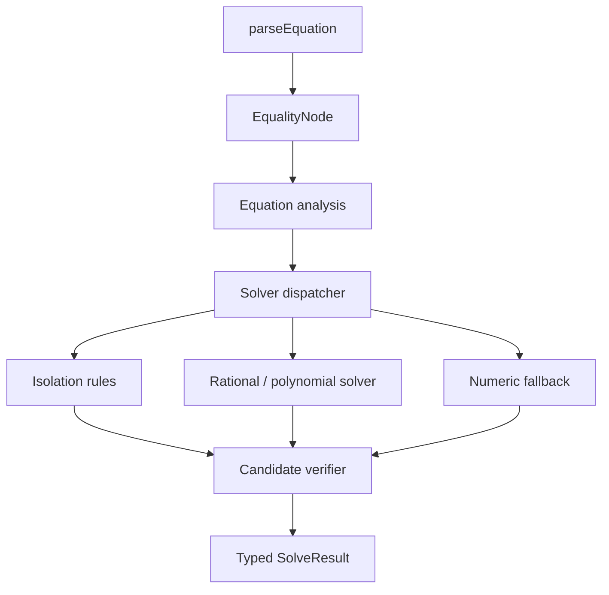

# symbolicjs implementation plan

Status: completed historical 0.1 milestone; superseded by
`advanced-solving-plan.md` and the current API guide
Baseline: `symbolicjs@0.0.1`  
Primary domain: real scalar equations represented by MathJS expression trees  
Canonical equation syntax: `lhs =:= rhs`

## 1. Purpose

symbolicjs extends a caller-owned MathJS instance with first-class symbolic equations and a bounded computer algebra solver. It remains independent of any consuming application's types, persistence formats, services, or presentation behavior.

The first solver milestone must:

- Represent equality as an immutable `EqualityNode(lhs, rhs)`.
- Parse exactly one top-level `=:=` while delegating each side to MathJS.
- Discover every free member symbol in an equation.
- Solve an equation independently for a requested member symbol.
- Offer a convenience operation that attempts the equation for every member symbol.
- Support common affine, power, quadratic, rational, exponential, logarithmic, square-root, absolute-value, and fully numeric cubic equations.
- Preserve domain restrictions and parameter conditions instead of silently dividing, rooting, or taking logarithms under invalid assumptions.
- Verify generated candidates against the original equation.
- Return typed outcomes for finite solutions, identities, contradictions, conditional results, partial results, unsupported families, and complexity limits.
- Fail conservatively. An unsupported result is preferable to an incorrect solution.

## 2. Boundaries

### In scope for the first complete solver

- Real scalar variables and parameters.
- One equation at a time.
- Solving for one target symbol per solver invocation.
- Solving the same equation independently for each free symbol.
- Exact symbolic results where supported.
- Approximate numeric roots only for explicitly bounded fallback paths.
- Conditions over expressions, initially `zero`, `nonzero`, `positive`, `nonnegative`, `negative`, and `nonpositive`.
- Candidate verification through substitution, simplification, definedness checks, and numeric evidence where exact proof is inconclusive.
- Deterministic complexity budgets.

### Explicitly out of scope

- Simultaneous systems and elimination across equations.
- Inequalities.
- Periodic trigonometric solution families.
- General symbolic cubic or quartic formulas.
- Symbolic polynomials above degree 2.
- Matrices, vectors, units, intervals, and tensors.
- General complex branch analysis.
- A complete theorem prover or general expression-equivalence engine.
- Mutation or replacement of MathJS's ordinary `parse`.
- Application-specific integration or replacement of another package's dependencies.

These exclusions must be represented by typed unsupported outcomes, not accidental exceptions or incomplete roots.

## 3. Design principles

1. **Use MathJS trees as the expression representation.** symbolicjs adds equation and solver semantics but does not create a competing expression AST.
2. **Keep installation instance-local.** All factories use the MathJS instance supplied by the consumer.
3. **Separate recognition from transformation.** Each solver rule first proves that it applies, then returns a new tree and accumulated conditions.
4. **Never cancel without recording a condition.** For example, dividing by symbolic `a` requires `a != 0`; cases where `a = 0` must be classified separately when material.
5. **Verify against the original equality.** A normalized or transformed equation is evidence, not the final authority.
6. **Bound all recursive work.** Tree size, rewrite count, branch count, polynomial degree, and numeric iterations need explicit limits.
7. **Keep results deterministic.** Stable ordering, canonical condition normalization, and repeatable formatting are part of the API contract.
8. **Preserve immutability.** Public operations return new nodes and never mutate caller-owned MathJS nodes.
9. **Keep exact and approximate answers distinguishable.**
10. **Every chapter ships green.** A chapter is complete only when its tests, public API documentation, and exit criteria pass independently.

## 4. Target architecture



Recommended module boundaries:

- `equation/`: node, parsing, serialization, formatting, symbol discovery.
- `core/`: result types, conditions, tree utilities, substitution, definedness, budgets, canonicalization.
- `solve/`: dispatcher, isolation, polynomial extraction, rational handling, numeric fallback, verification.
- `testing/`: optional corpus helpers that are not included in the production export surface unless consumers need them.

## 5. Proposed public API

Names are provisional until Chapter 1 freezes them, but the semantic distinctions are required.

```ts
interface symbolicjsInstance extends MathJsInstance {
  EqualityNode: EqualityNodeConstructor;
  parseEquation(source: string): EqualityNode;
  solveEquation(
    equation: EqualityNode | string,
    target: string,
    options?: SolveOptions
  ): SolveResult;
  solveEquationForAll(
    equation: EqualityNode | string,
    options?: SolveOptions
  ): ReadonlyMap<string, SolveResult>;
  equationSymbols(equation: EqualityNode): readonly string[];
}

type SolveResult =
  | FiniteSolutions
  | IdentityResult
  | ContradictionResult
  | PartialResult
  | UnsupportedResult
  | LimitResult;

interface Solution {
  readonly value: MathNode;
  readonly conditions: readonly Condition[];
  readonly exact: boolean;
  readonly verification: VerificationResult;
}

interface FiniteSolutions {
  readonly kind: 'finite';
  readonly target: string;
  readonly solutions: readonly Solution[];
}

interface IdentityResult {
  readonly kind: 'identity';
  readonly target: string;
  readonly conditions: readonly Condition[];
}

interface ContradictionResult {
  readonly kind: 'contradiction';
  readonly target: string;
  readonly conditions: readonly Condition[];
}

interface PartialResult {
  readonly kind: 'partial';
  readonly target: string;
  readonly solutions: readonly Solution[];
  readonly remainder: EqualityNode;
  readonly reason: UnsupportedReason;
}

interface UnsupportedResult {
  readonly kind: 'unsupported';
  readonly target: string;
  readonly reason: UnsupportedReason;
}

interface LimitResult {
  readonly kind: 'limit';
  readonly target: string;
  readonly limit: LimitKind;
}
```

Required behavioral decisions:

- Unknown target symbols return a typed unsupported/invalid-target result rather than an empty finite set.
- Duplicate roots are removed after canonicalization and verification.
- `solveEquationForAll` discovers free symbols, sorts them deterministically, and invokes the same single-target engine. It must not use results for one target to derive another.
- Strings accepted by solver entry points are parsed with `parseEquation`, never with a separate grammar.
- Expected mathematical limitations return result objects. Invalid API inputs and structurally invalid nodes may throw `TypeError` or `SyntaxError`.

## 6. Chapter plan

### Chapter 0 — Baseline and compatibility contract

**Goal:** lock down the behavior already published in `0.0.1` and establish reproducible quality gates before adding algebra.

**Deliverables**

- Record Node and MathJS support policy.
- Add an API snapshot or compile-time contract fixture for exported values and types.
- Add a clean packed-artifact smoke test that installs the tarball into a temporary consumer using MathJS.
- Characterize `EqualityNode` traversal, mapping, transformation, cloning, compilation, JSON round-trip, string, HTML, and TeX behavior.
- Characterize `parseEquation` for nesting, quotes, escapes, malformed delimiters, missing sides, duplicate top-level operators, and forbidden assignment nodes.
- Decide whether the current shallow `clone()` behavior is intentionally consistent with immutable MathJS child nodes; document it.
- Establish coverage thresholds for statements, branches, functions, and lines.
- Ensure CI runs supported Node versions and the minimum supported MathJS version.

**Risks**

| Risk | Mitigation |
|---|---|
| Algebra work relies on undocumented behavior of MathJS `Node` internals | Contract tests exercise every internal hook used by `EqualityNode` |
| The packed package differs from source-test behavior | Install and execute the output of `npm pack` in a clean fixture |
| Broad peer range claims unsupported compatibility | Test the minimum version and define a deliberate compatibility matrix |
| Parser regressions get mistaken for solver defects | Freeze parser error classes and representative messages before solver work |

**Tests**

- Unit tests for every node hook and parser boundary.
- JSON round-trip through the configured MathJS instance.
- Type-only consumer fixture compiled from package exports.
- ESM consumer smoke test against packed output.
- CI on Node 22, 24, and 26.
- Coverage enforcement.

**Exit gate**

- `npm run check`, packed-consumer smoke test, and coverage checks pass from a clean checkout.
- Public exports and supported runtime matrix are documented.
- No solver API is introduced in this chapter.

---

### Chapter 1 — Solver contracts, symbol analysis, and safety budgets

**Goal:** define the types and bounded execution model that every later solver must obey.

**Deliverables**

- Implement free-symbol discovery over both equality sides.
- Exclude function identifiers, accessor property names, constants supplied by the MathJS instance, and bound function parameters where relevant.
- Define `SolveResult`, `Solution`, `Condition`, `VerificationResult`, `UnsupportedReason`, and `SolveOptions`.
- Define default limits for input node count, rewrite steps, recursion depth, branch count, candidate count, polynomial degree, and numeric iterations.
- Add an internal solver context that accounts for every bounded operation.
- Add deterministic node and condition ordering.
- Introduce public factory functions or instance methods without implementing substantive solving; supported inputs may initially return `unsupported`.
- Define error policy: malformed input throws; mathematically unsupported input returns a typed result.

**Risks**

| Risk | Mitigation |
|---|---|
| Public unions are too narrow and force breaking changes | Model semantic categories now; keep diagnostic metadata extensible |
| Symbol discovery treats function names or properties as variables | Test every relevant MathJS node shape |
| Recursive expressions cause stack exhaustion or denial of service | Reject over-budget inputs before and during traversal |
| Different runs reorder solutions or conditions | Canonical sorting tests and frozen result objects |

**Tests**

- Symbol discovery for arithmetic, functions, accessors, constants, nested parentheses, and both equation sides.
- Empty-symbol equations.
- Unknown targets.
- Every budget independently produces the correct `limit` result.
- Immutability tests for result objects and caller-owned input trees.
- Exhaustive discriminated-union type tests.
- Deterministic serialization/order tests.

**Exit gate**

- Every public outcome is representable without exceptions.
- Symbol analysis and all budgets are tested.
- Later chapters can add rules without changing the top-level result taxonomy.

---

### Chapter 2 — Algebra kernel, conditions, and candidate verification

**Goal:** build the sound shared primitives required before any isolation rule can claim a solution.

**Deliverables**

- Immutable substitution of a target symbol with a MathJS node.
- Conservative simplification wrapper with an allowlisted rule set.
- Structural/canonical comparison suitable for deduplication, explicitly not advertised as general equivalence.
- Condition constructors and normalization for zero, nonzero, sign, and definedness predicates.
- Condition simplification: remove duplicates, detect direct contradictions, and fold known numeric predicates.
- Definedness analysis for division, powers, roots, logarithms, and non-finite numeric values.
- Candidate verifier that substitutes into the original equality.
- Verification statuses such as `proven`, `rejected`, and `inconclusive`.
- Numeric sampling for inconclusive parameterized identities, using deterministic seeded samples that satisfy known conditions.
- A strict rule: an inconclusive candidate can only appear in a marked partial/conditional result, never as a proven unconditional root.

**Risks**

| Risk | Mitigation |
|---|---|
| Aggressive simplification changes domains | Use an allowlist and preserve pre-transform conditions |
| Floating-point evaluation rejects exact roots or accepts near misses | Prefer exact simplification; use scale-aware tolerances only as evidence |
| Sampling is mistaken for proof | Keep `inconclusive` distinct in types and documentation |
| Substitution captures the wrong symbol or mutates input | Structural substitution tests and frozen-input tests |
| Conditions become contradictory or redundant | Normalize conditions before results leave the kernel |

**Tests**

- Substitution through every supported MathJS node shape.
- `1/x`, `sqrt(x)`, `log(x)`, fractional powers, and non-finite values.
- Extraneous roots from squaring, including `sqrt(x) =:= -1`.
- Denominator roots, including equations whose algebraic numerator vanishes where the original expression is undefined.
- Conditional parameter cases such as `a*x =:= b`.
- Deterministic sampling and tolerance boundary tests.
- Property tests: every `proven` numeric solution evaluates true in the original equality.

**Exit gate**

- The kernel can accept or reject supplied candidate roots against original equations.
- No solver rule is merged until it uses this verifier.
- Domain-changing transforms cannot discard their required conditions.

---

### Chapter 3 — Single-occurrence isolation

**Goal:** solve equations where the target appears once and can be isolated by invertible steps.

**Deliverables**

- Count target occurrences without expanding expressions.
- Orient an equation so the target-containing side is transformed.
- Implement inverse rules for:
  - Addition and subtraction.
  - Multiplication and division.
  - Unary plus and minus.
  - Integer and rational powers within the real-domain policy.
  - Square roots.
  - `exp` and `log`.
  - Absolute value with bounded branching.
- Accumulate conditions at every inverse step.
- Detect identities and contradictions reached during isolation.
- Send all terminal candidates through Chapter 2 verification.
- Return unsupported when an inverse is multivalued beyond the declared scope.

**Required examples**

- `x + a =:= b`
- `a - x =:= b`
- `a*x =:= b`
- `x/a =:= b`
- `a/x =:= b`
- `x^2 =:= a`
- `sqrt(x + 1) =:= a`
- `exp(x) =:= a`
- `log(x) =:= a`
- `abs(x - a) =:= b`

**Risks**

| Risk | Mitigation |
|---|---|
| Division by a symbolic expression loses zero-coefficient cases | Emit conditions and classify degenerate branches |
| Even powers return only one root | Branch to positive and negative candidates within the branch budget |
| Roots or logarithms violate the real domain | Add sign/definedness predicates before inversion |
| `abs` or powers cause exponential branching | Charge each branch to the solver context |
| Repeated target appearances are accidentally treated as isolated | Count occurrences before applying any rule |

**Tests**

- One table-driven test family per inverse rule and operand orientation.
- Numeric, symbolic-parameter, identity, contradiction, and degenerate cases.
- Branch ordering and deduplication.
- Extraneous-candidate rejection.
- Unsupported multivalued inverse functions.
- Limits triggered by nested inversions and branching.
- Round-trip property tests generated from known isolated forms.

**Exit gate**

- Every supported single-occurrence form returns verified roots and necessary conditions.
- Repeated-target expressions consistently defer to later solvers.
- No inverse rule bypasses budgets or verification.

---

### Chapter 4 — Rational normalization and affine solving

**Goal:** solve repeated-target linear equations, including rational forms, without unsafe cancellation.

**Deliverables**

- Convert an equation to a target-relative residual `lhs - rhs = 0`.
- Extract numerator and denominator structure without unrestricted expansion.
- Collect domain exclusions from every original denominator.
- Implement a sparse target-relative polynomial representation with MathJS nodes as coefficients.
- Extract degree 0 and degree 1 polynomials.
- Solve `a*x + b = 0` with explicit parameter cases:
  - `a != 0`: finite solution.
  - `a = 0` and `b = 0`: identity.
  - `a = 0` and `b != 0`: contradiction.
- Handle rational equations by solving the numerator and rejecting roots excluded by original denominators.
- Keep coefficient simplification conservative and budgeted.

**Required examples**

- `2*x + 3 =:= 9`
- `a*x + b =:= c`
- `x + x =:= a`
- `a*x + b*x =:= c`
- `1/x =:= a`
- `1/(x - 1) =:= 2`
- `x/(x - 1) =:= 1`
- `(x^2 - 1)/(x - 1) =:= 0`

**Risks**

| Risk | Mitigation |
|---|---|
| Clearing denominators introduces excluded roots | Preserve original denominator conditions and verify every root |
| Expansion causes expression explosion | Sparse extraction with node/rewrite budgets |
| Symbolic leading coefficients hide identity branches | Return conditional cases instead of assuming nonzero |
| Coefficients containing the target slip through extraction | Validate target-free coefficients at each term |

**Tests**

- Dense and sparse affine expressions on either side.
- Nested rational expressions and multiple denominators.
- Removable discontinuities.
- Symbolic coefficient degeneracy.
- Degree misclassification and target-bearing coefficients.
- Large expressions stopped by limits.
- Differential numeric checks over generated affine/rational cases.

**Exit gate**

- Affine and rational-affine corpus passes with no denominator-domain loss.
- Degenerate symbolic coefficient cases are explicit.
- Polynomial extraction never mutates or globally expands the input tree.

---

### Chapter 5 — Symbolic quadratic solving

**Goal:** solve target-relative polynomials of degree 2 over the real domain.

**Deliverables**

- Extend sparse extraction through degree 2.
- Normalize coefficients `a`, `b`, and `c`.
- Branch on the leading coefficient:
  - `a != 0`: quadratic.
  - `a = 0`: delegate to Chapter 4 affine classification.
- Compute and classify the discriminant.
- Return:
  - Two real roots when the discriminant is positive.
  - One deduplicated root when zero.
  - Contradiction/no real roots when negative.
  - Conditional roots when the discriminant sign is symbolic.
- Preserve denominator exclusions for rational quadratics.
- Verify and deduplicate all candidates against the original equation.

**Required examples**

- `x^2 =:= 4`
- `x^2 + 2*x + 1 =:= 0`
- `x^2 + 1 =:= 0`
- `a*x^2 + b*x + c =:= 0`
- `x^2 + a*x =:= 0`
- `(x^2 - 1)/(x - 1) =:= 0`

**Risks**

| Risk | Mitigation |
|---|---|
| Quadratic formula divides by a possibly zero leading coefficient | Separate the `a = 0` and `a != 0` cases |
| Symbolic discriminant has unknown sign | Return sign-conditioned branches or a partial result |
| Equivalent roots appear in different tree shapes | Canonicalize, then verify before deduplication |
| Catastrophic cancellation affects numeric coefficients | Preserve exact nodes; use stable numeric formulas only in numeric paths |

**Tests**

- Positive, zero, and negative numeric discriminants.
- Exact rational coefficients.
- Symbolic leading coefficient and discriminant conditions.
- Linear degeneration.
- Repeated roots and canonical ordering.
- Rational quadratic exclusions.
- Generated quadratics from known roots, followed by original-equation verification.

**Exit gate**

- All finite roots are verified and correctly marked exact.
- Negative-discriminant equations return no real roots, not complex values.
- Symbolic degeneracies remain explicit in the result.

---

### Chapter 6 — Function families and bounded numeric cubic fallback

**Goal:** complete the first-release target families without turning the package into an unbounded general solver.

**Deliverables**

- Expand supported single-occurrence compositions only where real inverse rules are sound.
- Define explicit handling for target appearances in bases versus exponents.
- Add fully numeric polynomial extraction through degree 3.
- Implement one documented numeric cubic method with:
  - Deterministic convergence behavior.
  - Root isolation or robust seed selection.
  - Configurable tolerance and iteration limits.
  - Real-root-only output.
  - Root polishing, deduplication, and residual checks.
- Mark numeric roots `exact: false`.
- Refuse symbolic cubic coefficients with a stable unsupported reason.
- Ensure unsupported periodic trigonometric families remain explicit.

**Risks**

| Risk | Mitigation |
|---|---|
| Numeric method misses repeated or clustered roots | Test discriminant regimes and use derivative-aware isolation |
| Near-real complex roots leak into real results | Enforce real-domain thresholds and residual verification |
| Tolerance merges distinct roots | Use scale-aware deduplication and adversarial close-root tests |
| Solver silently widens into unsupported transcendental search | Dispatch only allowlisted families |
| Platform differences change results | Deterministic algorithm and Node-version CI assertions |

**Tests**

- Cubics with 1, 2 repeated, and 3 distinct real roots.
- Triple roots, roots near zero, large/small coefficients, and close roots.
- No-real-additional-root cases.
- Iteration and candidate limits.
- Symbolic cubic rejection.
- Unsupported trig and mixed transcendental equations.
- Residual and original-equation verification on every returned numeric root.

**Exit gate**

- Numeric cubic results are stable across supported Node versions within documented tolerances.
- Exact and approximate solutions are never conflated.
- Unsupported transcendental families return typed results promptly.

---

### Chapter 7 — Solve-for-all orchestration and diagnostics

**Goal:** expose the primary consumer workflow: solve one equation independently for each member variable.

**Deliverables**

- Implement `solveEquationForAll` using Chapter 1 symbol discovery and the same single-target solver.
- Return stable symbol ordering and isolated results.
- Ensure one target's failure or limit does not suppress other targets.
- Add optional diagnostic tracing that records rule names, transformations, conditions, verification, and limit consumption.
- Keep diagnostics disabled by default and free of mutable MathJS nodes where practical.
- Add structured reason codes suitable for UI messages without exposing internal exception text.
- Document complexity and the fact that solving each symbol is independent, not simultaneous-system solving.

**Risks**

| Risk | Mitigation |
|---|---|
| Cross-target state contaminates results | Create a fresh solver context per target |
| One expensive target multiplies total work unexpectedly | Add per-target limits and an optional total equation budget |
| Diagnostics become a second unstable API | Version trace records and keep internal details optional |
| Symbol ordering changes across MathJS versions | Apply symbolicjs-owned stable ordering |

**Tests**

- Equations solvable for every symbol.
- Mixed results: finite for one symbol, unsupported for another.
- Independent budget exhaustion.
- Stable map/order and serialization.
- Diagnostic traces for representative rules and rejected candidates.
- No shared mutable nodes or condition arrays between targets.

**Exit gate**

- Every discovered symbol produces exactly one result.
- Results match direct single-target calls.
- Diagnostics are sufficient to explain rule selection and rejection without changing answers.

---

### Chapter 8 — Hardening, fuzzing, documentation, and stable release

**Goal:** make the complete solver suitable for public use and a stable semantic-versioned release.

**Deliverables**

- Build a permanent equation corpus covering examples, regressions, malformed input, identities, contradictions, denominator zeros, unsupported families, and complexity attacks.
- Add property-based generation for supported affine, rational, quadratic, isolated, and cubic forms.
- Add parser and solver fuzz tests with bounded runtime.
- Benchmark representative equations and publish budget/complexity expectations.
- Test supported MathJS versions and document the policy for adding a new major.
- Audit the packed artifact for unintended files and runtime dependencies.
- Complete API reference, examples, result-handling guide, limitations, and migration notes from `0.0.x`.
- Add security guidance for processing untrusted expressions.
- Decide the stable-release threshold and publish a release candidate before `1.0.0`.
- Record provenance through the existing trusted-publishing workflow.

**Risks**

| Risk | Mitigation |
|---|---|
| Handwritten tests encode the same mistakes as implementation | Generated known-solution cases and independent numeric evaluation |
| Fuzzing produces nondeterministic CI failures | Fixed seeds, persisted minimized regressions, strict time budgets |
| Peer dependency range exceeds tested compatibility | CI matrix defines the published range |
| Public API becomes stable before outcomes are adequate | Release candidate and explicit `1.0.0` checklist |
| Malicious expressions consume excessive resources | Preflight node limits plus runtime accounting and fuzzed limit tests |

**Tests and verification**

- Full unit, integration, type, property, fuzz, and packed-consumer suites.
- Coverage thresholds satisfied.
- Benchmarks remain within recorded regression tolerances.
- Clean install with only declared peer/runtime dependencies.
- API Extractor or equivalent public declaration review.
- Node 22, 24, and 26 CI.
- Minimum and latest supported MathJS compatibility runs.
- `npm pack --dry-run` inspection.
- Release-candidate installation from npm into at least one independent fixture.

**Exit gate**

- No known case returns an unverified unconditional root.
- Every unsupported scope item has a stable typed outcome.
- Documentation matches the packed API.
- Release candidate passes all matrices before `1.0.0`.

## 7. Cross-chapter test corpus

The corpus should be data-driven so the same cases can exercise parsing, direct target solving, solve-for-all, formatting, serialization, and packed-package behavior.

Each case should include:

- Source equation.
- Target symbol.
- Expected result kind.
- Expected exact or approximate roots.
- Expected conditions.
- Expected verification status.
- Expected unsupported/limit reason when applicable.
- Optional numeric scopes for independent evaluation.
- Tags identifying the owning solver family and regression.

Minimum categories:

- Valid and malformed `=:=` syntax.
- Numeric identities and contradictions.
- Parameterized identities and contradictions.
- All inverse operand orientations.
- Zero and nonzero symbolic coefficients.
- Positive, zero, negative, and symbolic discriminants.
- Original denominator exclusions and removable discontinuities.
- Extraneous roots from even powers and squaring.
- Undefined logarithm, root, division, and non-finite cases.
- Unsupported repeated transcendental and trigonometric forms.
- Complexity-limit boundaries.
- Numeric cubic root multiplicities and scale extremes.

## 8. Version roadmap

This is a planning guide rather than a promise; versions may be combined when a chapter is small, but chapter exit gates must not be skipped.

| Version | Intended milestone |
|---|---|
| `0.0.1` | Published EqualityNode and parser boundary |
| `0.1.0` | Chapters 0–2: contracts, analysis, conditions, verification |
| `0.2.0` | Chapter 3: single-occurrence isolation |
| `0.3.0` | Chapter 4: rational and affine solver |
| `0.4.0` | Chapter 5: symbolic quadratic solver |
| `0.5.0` | Chapter 6: supported functions and numeric cubic fallback |
| `0.6.0` | Chapter 7: solve-for-all and diagnostics |
| `1.0.0-rc.1` | Chapter 8 complete; public API candidate |
| `1.0.0` | Stable API after release-candidate validation |

## 9. Definition of done for every chapter

A chapter is complete only when:

1. Its implementation is isolated and reviewable.
2. New public behavior is documented.
3. Unit tests cover success, failure, degenerate, and limit paths.
4. Every identified risk has a specific passing mitigation test.
5. Inputs remain immutable.
6. Results are deterministic.
7. Candidates are checked against the original equation when the chapter produces solutions.
8. `npm run check` passes on all supported Node versions.
9. The packed-consumer smoke test passes.
10. No later chapter is required to make the current chapter's advertised behavior sound.

## 10. First implementation task

Begin with Chapter 0, not solver rules. The immediate pull request should harden the published `0.0.1` contract, add packed-consumer verification and coverage gates, and resolve any discrepancies before the result model becomes public. Chapter 1 should then land as a separate, fully green change.
