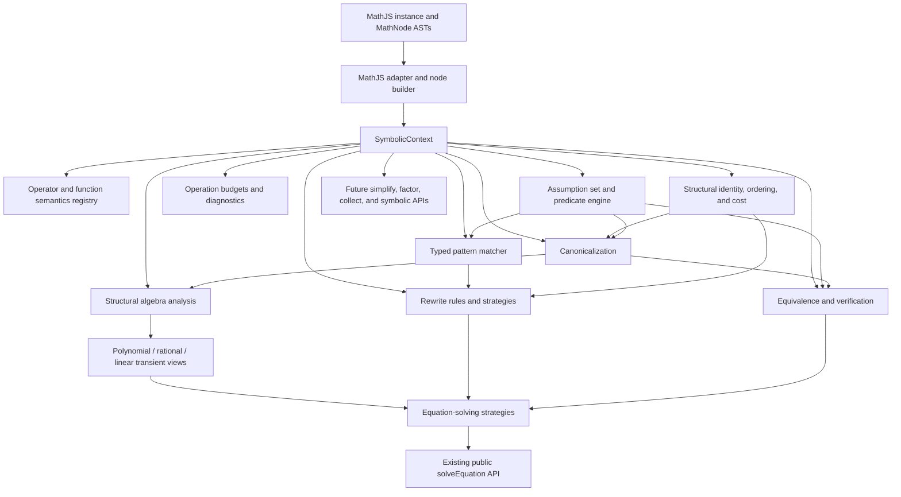

# SymbolicJS: MathJS-Native Symbolic Algebra Layer Implementation Plan

**Status:** proposed; planning artifact only  
**Repository:** `Wu-Li/symbolicjs`  
**Baseline branch:** `ci/release-gated-verification`  
**Baseline commit:** `f37f1636689c382cc514d29cc168d0aa010baee7`  
**Baseline package:** `symbolicjs@0.5.3`  
**Primary architectural decision:** MathJS `MathNode` objects remain the canonical public, persistence, compilation, and interchange representation. SymbolicJS adds the semantic machinery required for symbolic algebra around those nodes. Equation solving becomes one consumer of that machinery rather than the organizing center of the package.

---

## 1. Executive decision

SymbolicJS should no longer be developed primarily as a sequence of equation-class recognizers. It should become a **MathJS-native symbolic algebra layer** with reusable facilities for:

1. canonicalization;
2. assumptions and domains;
3. structural algebra analysis;
4. typed pattern matching;
5. transformation rules and strategies;
6. expression equivalence and cost.

Equation classes still matter, but as **acceptance cases that expose missing general primitives**, not as architectural module boundaries. A failure such as

```text
sqrt(x + 1) + sqrt(x - 1) = 4
```

should drive improvements in radical discovery, target-dependency analysis, isolation strategies, conditional squaring, normalization, and verification. It should not lead directly to a bespoke “two-radical equation solver.”

Nerdamer remains useful as:

- a corpus of inputs and expected behavior to investigate;
- a source of algorithm names and implementation ideas;
- a differential oracle whose answers are independently verified;
- evidence about which algebraic transformations produce practical coverage.

It should **not** become the architecture to port. Its solver is coupled to Nerdamer’s mutable symbol representation, parser groups, factorization, calculus, matrices, and global state. Porting it wholesale would largely recreate Nerdamer inside a MathJS adapter.

---

## 2. How far MathJS ASTs can take the project

MathJS ASTs are sufficient as the long-term public representation. They already provide:

- parsing and formatting;
- standard node constructors and custom nodes;
- traversal, mapping, and transformation;
- compilation and evaluation;
- JSON serialization and revival;
- configured numeric types and a caller-owned namespace;
- factory-based extension on a particular MathJS instance;
- an existing simplifier with customizable rules and operator contexts.

The missing pieces are primarily **semantic**, not representational:

- a symbol or subexpression does not carry assumptions;
- structural equality is not algebraic equivalence;
- functions do not expose a uniform symbolic domain, inverse, parity, or periodicity contract;
- operators are not interpreted under a per-expression algebraic domain;
- there is no general typed matcher with semantic predicates;
- rewrite orchestration, proof obligations, and cost-based progress are not first-class;
- specialized forms such as polynomials and rational functions are not reusable symbolic views.

The plan therefore adds an external, immutable semantic context around MathJS nodes. It does **not** attach mutable metadata to nodes and does not introduce a second general-purpose expression AST.

### 2.1 Transient representations are still necessary

“No second AST” must not prohibit specialized temporary representations. Robust CAS algorithms need domain-specific views such as:

- a flattened additive or multiplicative term list;
- a coefficient/monomial map;
- a sparse polynomial over selected generators;
- a rational function with numerator, denominator, and domain obligations;
- a linear form over selected basis atoms;
- an affine transform;
- a periodic family.

These views are ephemeral, reference or contain MathJS nodes, and rebuild MathJS nodes through the configured instance. They are algorithmic data structures, not competing persistence formats.

### 2.2 Expected limits of the approach

MathJS nodes should not prevent substantial progress in scalar algebra, assumptions, simplification, factoring, transformation, and solving. Friction is likely in:

- full complex branch analysis;
- noncommutative algebra where operator properties depend on inferred value types;
- canonical treatment of special functions;
- very large rewrite searches where a hash-consed DAG or e-graph becomes materially more efficient;
- mutation by callers, which complicates long-lived caches;
- unsupported custom nodes or custom functions without registered symbolic semantics.

None of those limitations justifies replacing MathJS nodes now. The architecture will leave room for an optional backend or internal optimization layer if measured constraints later demand one.

---

## 3. Architectural principles

1. **MathJS owns expression representation.** Public inputs and outputs remain `MathNode`s created by the consumer’s MathJS instance.
2. **Semantic state is external.** Assumptions, domains, registries, budgets, and traces live in immutable SymbolicJS contexts, never on caller-owned nodes.
3. **Every operation is instance-local.** No global symbol tables, registries, caches, or function assumptions may leak between MathJS instances.
4. **Unknown is not false.** Semantic queries use three-valued judgments: proven, disproven, or unknown.
5. **Conditional transformations preserve obligations.** A rewrite that is valid only when `x != 0` may either decline or return that requirement; it may never silently discard it.
6. **Canonicalization is profile- and domain-dependent.** There is no claim of one universal canonical form.
7. **Matching is structural plus semantic.** A pattern can require a captured expression to be target-free, scalar, real, nonzero, integral, polynomial, or otherwise proven by the context.
8. **Strategies own orchestration.** Rules do not recursively call unrelated solver engines. A bounded strategy decides traversal, repetition, branching, and selection.
9. **Progress is measurable.** Structural fingerprints, visited-state detection, budgets, and explicit cost functions prevent rewrite oscillation and uncontrolled expansion.
10. **Sampling can disprove, not prove.** Numeric counterexamples may reject a proposed identity. Numeric agreement alone cannot establish a symbolic identity.
11. **Specialized algorithms consume shared analysis.** Polynomial, trigonometric, radical, and solver modules do not independently rediscover free symbols, coefficients, definedness, or node construction.
12. **Migration is incremental.** New infrastructure is introduced beside the current implementation, then existing consumers move one at a time under compatibility tests.
13. **No new equation families during the infrastructure migration.** New capabilities resume after the current solver is rebuilt over the shared symbolic layer.
14. **Package growth is measured.** Bundle deltas, packed size, and performance are tracked per milestone; repository source size alone is not the optimization target.

---

## 4. Proposed target architecture



### 4.1 Provisional core contracts

Names are provisional until the relevant chapter freezes them.

```ts
type TruthValue = 'proven' | 'disproven' | 'unknown';

interface Judgment {
  readonly truth: TruthValue;
  readonly requirements: readonly SymbolicPredicate[];
  readonly evidence?: readonly SymbolicEvidence[];
}

interface SymbolicContextOptions {
  readonly assumptions?: AssumptionSet;
  readonly domain?: SymbolicDomain;
  readonly limits?: Partial<OperationLimits>;
  readonly mode?: 'strict' | 'conditional';
  readonly diagnostics?: boolean;
}

interface SymbolicContext {
  readonly math: MathJsInstance;
  readonly assumptions: AssumptionSet;
  readonly registry: SymbolicRegistry;

  with(options: SymbolicContextOptions): SymbolicContext;
  ask(predicate: SymbolicPredicate): Judgment;
  canonicalize(node: MathNode, profile?: CanonicalProfile): TransformResult;
  analyze(node: MathNode): ExpressionAnalysis;
  match(node: MathNode, pattern: Pattern): MatchResult | null;
  transform(node: MathNode, strategy: RewriteStrategy): TransformResult;
  equivalent(left: MathNode, right: MathNode): EquivalenceResult;
}

interface TransformResult {
  readonly node: MathNode;
  readonly changed: boolean;
  readonly requirements: readonly SymbolicPredicate[];
  readonly trace?: readonly TransformStep[];
}
```

The public API should eventually expose an instance-local object such as `math.symbolic`. The existing `math.symbolicKernel` remains a compatibility facade until all internal consumers have migrated and a deliberate public-version decision is made.

---

## 5. Current implementation assessment and redesign map

### 5.1 What should be preserved

| Current component | Decision |
|---|---|
| `EqualityNode` and `parseEquation` | Preserve. They are already MathJS-native and instance-local. |
| `SolveResult`, exact/approximate distinctions, scopes, diagnostics, and certificates | Preserve initially. Expand only through a deliberate API revision. |
| Candidate verification policy | Preserve the conservative policy, but rebuild it over the equivalence and assumption engines. |
| Deterministic budgets and typed limits | Preserve, then generalize beyond solving. |
| Parametric-family representation | Preserve, then migrate its canonicalization and substitution. |
| Numeric polynomial engine | Preserve as a mostly independent numeric algorithm; replace only its solver-specific budget coupling. |
| Bounded numeric fallback | Preserve; migrate its definedness and predicate evaluation. |
| Conformance, property, hardening, packed-consumer, and public-type tests | Preserve as migration gates. |

### 5.2 What should be redesigned

| Current component | Architectural problem | Target redesign |
|---|---|---|
| `src/kernel.ts` | Mixes substitution, simplification, conditions, definedness, canonical keys, scalar conversion, sampling, and candidate verification. | Compatibility facade over focused core services. |
| `src/analysis.ts` | Free-symbol analysis is narrow and separate from duplicated target-occurrence and constant-analysis helpers. | Unified structural analyzer with instance namespace awareness. |
| `src/budget.ts` | Solver-specific result coupling and counters. | General per-operation context with adapters back to `LimitResult`. |
| `SymbolicKernel.canonicalKey()` | Uses simplification plus `toString()`, which is formatting-sensitive and not a robust semantic identity. | Stable structural fingerprint after profile-specific canonicalization. |
| Existing `Condition` model | Flat solver-oriented sign/definedness union with no domain lattice or general inference. | Internal predicate and assumption system, projected to legacy `Condition` at solver boundaries. |
| `src/polynomial.ts` | Private rational/polynomial extraction, node construction, verification, formulas, complex handling, and dispatch are concentrated in one large solver. | Reusable algebra views plus separate polynomial solver algorithms. |
| `src/isolate.ts` | Bespoke operation reversal, occurrence counting, branching, and queue traversal. | Typed inverse rules executed by a generic bounded strategy. |
| `src/trigonometric.ts` | Direct AST scanning, placeholder symbols, custom numeric probing, and reliance on polynomial solving for affine analysis. | Function semantics registry, matcher, affine analyzer, and family constructors. |
| `src/compound-trigonometric.ts` | Private rewrite loop and hand-written structural recognizers for each identity. | Named rule pack plus generalized basis/linear-form analysis. |
| `src/parametric.ts` | Implements its own symbol replacement and uses the weak canonical key. | Shared substitution, canonicalization, equivalence, and hygienic binding utilities. |
| `src/numeric-solve.ts` | Duplicates condition evaluation and numeric conversion. | Shared predicate evaluator and general operation context. |
| `src/solve.ts` | Hard-coded precedence and special partial-merging logic. | Registered solver strategies with explicit applicability, priority, completeness, and merge policy. |
| `src/install.ts` | One all-inclusive factory list makes core-only consumption and bundle analysis difficult. | Core and solver factory groups, while preserving the existing all-in-one installer. |
| Public engine-class exports | Expose implementation details that make refactoring harder. | Preserve compatibility wrappers; introduce stable interfaces and defer removals to a deliberate version boundary. |

### 5.3 Current dependency order that drives migration

```text
analysis ─┐
budget ───┼──> kernel ───> isolate
          │       ├──────> polynomial ───> trigonometric ───> compound trig
          │       ├──────> parametric ────┘
          │       └──────> numeric solve
          └──────────────────────────────────────────────────┘

solve hard-codes the strategy order and feeds solve-for-all
```

The migration must therefore establish the new core first, replace `kernel.ts` through a facade, then move polynomial/parametric consumers before rebuilding isolation and trigonometric strategies.

---

## 6. Chapter execution policy

Each chapter is an independently reviewable implementation unit. It must be complete and green before work begins on the next chapter.

For every chapter:

1. Update the impact map before editing.
2. Add or update the chapter’s focused tests first.
3. Implement only the contracts owned by that chapter.
4. Keep old public behavior available through adapters when later chapters have not migrated yet.
5. Run the chapter’s focused tests, `npm run typecheck`, and `npm run build` when applicable.
6. Run `npm run check` only at the explicitly identified cross-cutting integration gates or when the actual impact proves broader than planned.
7. Do not add unrelated equation families to make the new infrastructure look productive.
8. Keep inputs immutable, outputs deterministic, and resource use bounded.
9. Record bundle, benchmark, or API changes when the chapter affects them.
10. Commit one chapter at a time; do not include scaffolding that cannot yet be exercised.

### Full-check integration gates

The complete local `npm run check` gate is required after:

- Chapter 0, to freeze the baseline;
- Chapter 8, when equivalence and verification become usable as a coherent core;
- Chapter 10, after the largest existing solver subsystem is migrated;
- Chapter 13, after solver dispatch is replaced;
- Chapter 14, before the infrastructure milestone is considered complete.

The release workflow will still execute the full Node/MathJS matrix before any new package version is published.

---

# Chapter plan

## Chapter 0 — Freeze behavior, measure the baseline, and establish the migration harness

### Goal

Create a trustworthy behavioral and performance baseline so the core can be redesigned without confusing intentional structural changes with solver regressions.

### Deliverables

- Record commit `f37f1636689c382cc514d29cc168d0aa010baee7` as the architecture-migration baseline.
- Inventory every current public export, including implementation classes currently exported from `src/index.ts`.
- Add a machine-readable map from current modules to planned core/algebra/solver layers.
- Freeze representative semantic output for every existing result kind without requiring exact pretty-print ordering where semantics are equivalent.
- Add a dual-run harness that can compare a legacy operation with a new operation during later migration chapters.
- Add baseline measurements for:
  - packed package size;
  - production JavaScript byte counts by module;
  - representative canonicalization/simplification operations;
  - current solver corpus timings;
  - peak node counts for selected symbolic cubic and quartic expressions.
- Define which tests require exact string compatibility and which compare canonical semantic results.
- Document that no new equation classes are in scope until Chapter 14 is complete.

### Existing code affected

Testing and documentation only. Production algorithms remain untouched.

### Risks and mitigations

| Risk | Mitigation |
|---|---|
| The migration silently changes public exports or result semantics | Snapshot public declarations and normalize semantic comparisons before implementation starts. |
| String snapshots overconstrain harmless canonical ordering improvements | Separate presentation contracts from mathematical-result contracts. |
| Benchmarks are noisy and later become useless | Use named deterministic cases, warm-up, repeated runs, and broad regression thresholds derived from the baseline. |
| The dual-run harness becomes production baggage | Keep it under `test/support` unless a diagnostic-only production hook is explicitly justified. |

### Tests

- Existing public API type fixture compiles unchanged.
- Existing conformance and corpus suites pass unchanged.
- Packed-consumer test passes.
- New baseline fixture loader rejects malformed or duplicate cases.
- Semantic comparator distinguishes finite, parametric, partial, identity, contradiction, unsupported, and limit results.
- Full `npm run check` passes from a clean checkout.

### Exit gate

The current package is reproducibly characterized, the migration comparator is usable, and every later chapter has an objective parity target.

---

## Chapter 1 — MathJS integration substrate and general operation context

### Goal

Build the instance-local substrate on which all symbolic services will run without yet changing solver behavior.

### Deliverables

- Introduce a `MathAdapter` or equivalent internal service containing only supported MathJS instance facilities used by SymbolicJS.
- Introduce a shared `NodeBuilder` that constructs constants, symbols, operators, functions, and equalities through constructors from the configured MathJS instance.
- Introduce immutable `OperationContext` objects containing:
  - the MathJS adapter;
  - assumptions and default domain placeholders;
  - limits and counters;
  - diagnostics/tracing controls;
  - operation mode (`strict` or `conditional`);
  - per-operation memoization.
- Generalize `SolverContext` counters into operation-neutral limits while retaining an adapter that produces current `LimitResult` values.
- Introduce an instance-local `SymbolicRegistry` for operator and function semantics.
- Add `math.symbolic` as an internal/experimental service object while retaining `math.symbolicKernel` unchanged.
- Ensure all new services are imported with MathJS factories and have no module-global mutable state.
- Define the supported MathJS API boundary: use public constructors, traversal, transformation, equality, compile, JSON, and factory APIs; isolate any unavoidable private hook use to `EqualityNode`.

### Existing code affected

- `src/custom-factory.ts`
- `src/install.ts`
- `src/types.ts`
- `src/budget.ts` through an adapter, not immediate removal
- new `src/core/*` modules

### Risks and mitigations

| Risk | Mitigation |
|---|---|
| Symbolic state leaks between separately configured MathJS instances | Multi-instance tests with different constants, functions, and number configurations. |
| The adapter accidentally freezes SymbolicJS to undocumented MathJS internals | Explicit adapter contract and a test that lists every dependency requested from MathJS factories. |
| A general context duplicates every solver option and creates conversion bugs | Keep solver option adaptation in one boundary function. |
| Memoization becomes stale if callers mutate MathNodes | Limit caching to one operation initially and document that SymbolicJS never mutates inputs. |
| New factory dependencies introduce cycles | Build a dependency graph test and keep the registry/context below all high-level functions. |

### Tests

- Two MathJS instances with different custom constants/functions produce isolated registries and results.
- NodeBuilder output belongs to the configured instance and survives JSON round-trip with that instance’s reviver.
- Number configurations covering ordinary numbers, BigNumber, Fraction where supported, and Complex do not cross-contaminate.
- Every operation limit is deterministic and can be independently exhausted.
- Existing solver tests remain unchanged because legacy services still own behavior.
- Focused tests: new context/adapter tests, `test/equality-node.spec.ts`, `test/solver-contract.spec.ts`, typecheck, and build.

### Exit gate

A MathJS-native symbolic context can be created and queried on every installed instance, but no existing solve result has changed.

---

## Chapter 2 — Predicate, assumptions, and domain system

### Goal

Replace ad hoc sign and definedness checks with a conservative, extensible semantic judgment system.

### Deliverables

- Define `TruthValue`/`Judgment` with proven, disproven, and unknown outcomes.
- Define immutable symbolic predicates for the initial scope:
  - domain membership: integer, rational, real, complex;
  - zero/nonzero;
  - positive/nonnegative/negative/nonpositive;
  - finite and defined;
  - even/odd for integral expressions;
  - scalar/commutative eligibility where needed for safe operator rules.
- Define an immutable `AssumptionSet` with scoped extension and contradiction detection.
- Implement the initial domain lattice:

  ```text
  integer ⊂ rational ⊂ real ⊂ complex
  ```

- Implement conservative implication rules such as positive → nonzero → defined and integer → rational → real → complex.
- Add operator/function semantic records for the MathJS built-ins currently used by SymbolicJS: arithmetic, powers, `sqrt`, `nthRoot`, `exp`, logarithms, absolute value, circular functions, and inverse circular functions.
- Treat unregistered custom functions as opaque but defined only when explicitly assumed or successfully evaluated.
- Implement `ask(predicate)` and `require(predicate)`:
  - `ask` returns a three-valued judgment;
  - `require` succeeds, rejects, or returns an obligation in conditional mode.
- Adapt existing `Condition` values to internal predicates and back.
- Keep the existing public solver `Condition` union unchanged during this migration. Predicates that cannot be projected safely force partial/unsupported solver results until a separate API revision is approved.
- Replace `conditionsForDefinedness()` internally with a predicate-producing domain analysis, while keeping its current compatibility signature.

### Existing code affected

- new `src/core/predicate.ts`, `assumptions.ts`, `domains.ts`, and semantic registry modules
- compatibility path in `src/kernel.ts`
- `src/solve-types.ts` only for internal adapters; no public union expansion yet

### Risks and mitigations

| Risk | Mitigation |
|---|---|
| Unsound inference creates mathematically false rewrites | Start with a small implication set; every inference rule requires direct positive and negative tests. |
| “Unknown” is accidentally treated as permission | Strict mode declines unknown predicates; only conditional mode may emit obligations. |
| Real-domain facts are reused in complex mode | Domain is part of every operation context and every cached judgment key. |
| Matrix or unit expressions are incorrectly treated as commutative scalars | Reordering requires proven scalar/commutative eligibility, not merely an operator name. |
| Existing solver conditions change shape | Maintain a dedicated legacy projection and parity tests. |

### Tests

- Domain-lattice implication and non-implication tables.
- Contradictory assumptions such as real and non-real, zero and nonzero, positive and nonpositive.
- Scoped assumptions do not mutate parent contexts.
- `sqrt(x)` is defined over reals only when `x >= 0`; complex contexts do not inherit the same range requirement.
- `x / x` requires `x != 0`; no assumption silently cancels it.
- `sqrt(x^2)` does not become `x` without appropriate assumptions.
- Unknown custom functions remain opaque.
- Existing `test/kernel.spec.ts` domain-condition expectations pass through the compatibility facade.
- Focused tests: assumptions/domain tests plus kernel definedness tests, typecheck, and build.

### Exit gate

The package can answer semantic questions conservatively and express unresolved requirements without changing existing solver output contracts.

---

## Chapter 3 — Structural identity, deterministic ordering, and expression cost

### Goal

Create reliable infrastructure for fixed-point detection, deduplication, deterministic output, and rewrite progress without relying on pretty-printed strings.

### Deliverables

- Implement a stable structural encoding/fingerprint for supported MathJS nodes.
- Distinguish:
  - raw structural identity;
  - canonical structural identity;
  - semantic equivalence, which remains a later concern.
- Normalize supported constant payloads, including ordinary numbers, `-0`, bigint, Fraction, BigNumber, and Complex where available.
- Add a deterministic total ordering over supported expressions.
- Define an extensible cost vector rather than one scalar score, initially including:
  - node count;
  - depth;
  - function depth;
  - number of divisions and negative powers;
  - target occurrences;
  - number of non-polynomial operators;
  - estimated branch count;
  - presentation penalty.
- Define named cost profiles, such as `simplify`, `isolate(target)`, `polynomial`, and `presentation`.
- Add registry hooks for custom node fingerprints and costs; unsupported custom nodes receive a typed fallback rather than silently colliding.
- Use per-operation memoization keyed by node identity plus context/profile identity.

### Existing code affected

- new `src/core/fingerprint.ts`, `order.ts`, and `cost.ts`
- no solver migration yet

### Risks and mitigations

| Risk | Mitigation |
|---|---|
| Fingerprint collisions corrupt deduplication | Begin with canonical structural strings, not truncated hashes; hashes may be added only as cached accelerators. |
| Fingerprints change with MathJS formatting | Encode node type and fields directly rather than calling `toString()`. |
| Custom values cannot be serialized deterministically | Require registered codecs or return a typed unstable/unsupported identity. |
| One cost score favors pathological expressions | Use lexicographic or profile-specific vectors and test the ordering policy explicitly. |
| Deep input overflows recursion | Iterative traversal or depth-budget enforcement. |

### Tests

- Clones and JSON-revived nodes have identical structural fingerprints.
- Distinct ASTs that print similarly remain distinguishable when structurally different.
- Operand permutations have deterministic but not yet necessarily equal raw fingerprints.
- Constant normalization covers `0`, `-0`, rational values, and complex zero components.
- No collisions across the permanent conformance corpus and generated bounded trees.
- Cost profile tests establish expected ordering without claiming algebraic equivalence.
- Limit tests for depth and node count.

### Exit gate

Later engines can detect revisited states and sort outputs without `toString()`-based keys.

---

## Chapter 4 — Canonicalization engine

### Goal

Provide deterministic, idempotent canonical forms that are safe for a declared domain and assumption context.

### Deliverables

- Define canonicalization profiles rather than one universal canonical form:
  - `structural`: syntax-only normalization safe for unknown values;
  - `scalar`: associative/commutative scalar normalization when proven;
  - `real-algebraic`: real-domain power/root normalization under assumptions;
  - `complex-safe`: transformations valid without choosing unstated branches;
  - `presentation`: stable human-readable ordering without changing semantics.
- Implement a first set of canonical operations:
  - remove redundant parentheses and unary plus;
  - normalize unary minus and negative zero;
  - flatten associative additions and multiplications;
  - sort commutative operands using Chapter 3 ordering only when commutativity is proven;
  - fold exact constants using the configured MathJS instance;
  - extract and normalize numeric coefficients;
  - remove proven identities and annihilators;
  - preserve undefined cases and branch-sensitive powers;
  - normalize equality side structure without changing `EqualityNode` syntax.
- Use MathJS `simplifyCore` and selected `simplify` rules only through explicit safe contexts. The default permissive simplifier is not a proof engine.
- Return requirements and transformation trace for conditional canonicalization.
- Guarantee idempotence for each profile.
- Replace `SymbolicKernel.canonicalKey()` behind its compatibility facade with canonical fingerprinting from Chapters 3–4.

### Existing code affected

- new `src/core/canonicalize/*`
- compatibility implementation in `src/kernel.ts`
- parametric and solver consumers continue using the facade until later chapters

### Risks and mitigations

| Risk | Mitigation |
|---|---|
| Reordering changes matrix or unit semantics | Require semantic proof of commutative scalar operations. |
| Power rewrites change complex branches | Separate real-algebraic and complex-safe rule sets and require explicit predicates. |
| Canonicalization expands expressions uncontrollably | Canonicalization does not perform general distribution; enforce node-growth and rewrite budgets. |
| MathJS simplification performs a rule SymbolicJS cannot justify | Use explicit rule lists/contexts and regression tests for known unsafe forms. |
| Output ordering breaks public string examples | Identify presentation contracts in Chapter 0 and update only through deliberate migration notes. |

### Tests

- Idempotence: `canonicalize(canonicalize(x))` is structurally identical to `canonicalize(x)`.
- Permutation invariance for proven scalar sums/products.
- No mutation of input nodes.
- Domain-sensitive cases: `x/x`, `sqrt(x^2)`, `(x*y)^a`, `x^a*x^b`, logarithm combinations, and zero powers.
- Real versus complex profile comparisons.
- Custom MathJS constants and number configurations.
- Property tests: evaluation before/after agrees on generated scopes satisfying requirements.
- Focused regression: kernel canonical-key tests and parametric deduplication tests.

### Exit gate

Canonicalization is deterministic, idempotent, assumption-aware, and usable as a stable identity layer without broad algebraic expansion.

---

## Chapter 5 — Structural algebra analysis and transient algebraic views

### Goal

Turn recurring AST-inspection logic into reusable, solver-independent algebra analysis.

### Deliverables

- Consolidate basic analysis:
  - free symbols;
  - dependency on selected symbols or atoms;
  - occurrence counts;
  - target-free classification;
  - constant-expression classification;
  - safe configured-instance evaluation;
  - function/operator inventory;
  - definedness predicates.
- Add reusable views with `rebuild()` and requirements:
  - `SumView` and `ProductView`;
  - `PowerView`;
  - `AffineView`;
  - `LinearForm` over arbitrary selected basis atoms;
  - `SparsePolynomialView` over one or more selected generators;
  - `RationalFunctionView` preserving every denominator obligation.
- Define coefficients as MathJS nodes proven independent of the selected generators.
- Design sparse polynomial monomials as exponent vectors/maps so multivariate analysis is possible even though simultaneous solving is not yet implemented.
- Keep expansion explicit and budgeted. Analysis may return “not representable” without modifying the input.
- Move the private rational/polynomial extraction logic out of `PolynomialEngine` behind an adapter.
- Move the private compound-trig `LinearForm` logic behind the generalized basis analyzer.
- Extend canonicalization with polynomial and rational profiles that rebuild these views deterministically.

### Existing code affected

- `src/analysis.ts`
- the extraction portion of `src/polynomial.ts`, initially through delegation
- the linearization portion of `src/compound-trigonometric.ts`, initially through delegation
- new `src/algebra/*` modules

### Risks and mitigations

| Risk | Mitigation |
|---|---|
| Expansion causes exponential expression growth | Require explicit expansion budgets and prefer sparse convolution over AST distribution. |
| A target-dependent expression is accepted as a coefficient | Assert generator-independence for every coefficient and property-test reconstruction. |
| Rational normalization drops denominator restrictions | Requirements are part of the view and round-trip contract. |
| Multivariate design makes the initial implementation unnecessarily complex | Support a generic monomial key but implement only operations required by current consumers. |
| Rebuilt expressions differ in harmless ordering and break tests | Compare canonical fingerprints except where presentation is a frozen public contract. |

### Tests

- View round-trips preserve canonical semantic form.
- Univariate and multivariate degree/coefficient extraction.
- `x*y` is a monomial in generators `{x,y}` and a linear term in `x` with coefficient `y`.
- Rational cases preserve all original denominator nonzero requirements.
- Negative and nonintegral powers are rejected from polynomial views unless transformed by an explicit separate rule.
- Generalized linear forms reproduce current amplitude-phase coefficient extraction.
- Limits on degree, monomial count, convolution work, and node growth.
- Differential parity against current `debugPolynomial()` and polynomial fixtures.

### Exit gate

No solver needs private code to answer “is this affine, polynomial, rational, or linear in these atoms?”

---

## Chapter 6 — Typed pattern matching with semantic predicates

### Goal

Provide a deterministic matcher capable of expressing algebraic rules without embedding recognizer logic inside each solver.

### Deliverables

- Define typed pattern combinators for:
  - literal nodes;
  - captures;
  - repeated/same captures;
  - operators and functions;
  - alternatives and optional forms;
  - variadic/rest operands for flattened sums/products;
  - predicate-guarded captures.
- Provide initial semantic predicates:
  - `freeOf(symbols)`;
  - `dependsOn(symbols)`;
  - `numeric`, `integer`, `real`, `nonzero`, and other Chapter 2 judgments;
  - `affineIn`, `polynomialIn`, and `rationalIn` backed by Chapter 5;
  - `sameAs(binding)` using structural identity by default and explicit equivalence only when requested.
- Implement ordered structural matching first.
- Implement bounded associative/commutative matching over canonicalized flattened operands.
- Return immutable bindings, accumulated requirements, and optional diagnostics.
- Charge all branching/backtracking to operation budgets.
- Support patterns built as data/combinators; do not create a competing expression AST.

### Existing code affected

New core matcher modules only. Existing solvers are not migrated in this chapter.

### Risks and mitigations

| Risk | Mitigation |
|---|---|
| Associative/commutative matching becomes factorial | Canonicalize first, use deterministic partitioning, and enforce branch budgets. |
| Repeated captures accidentally use formatting equality | Use Chapter 3 structural identity or an explicitly requested equivalence mode. |
| Predicate guards have side effects or mutate assumptions | Guards receive immutable contexts and return judgments only. |
| Pattern syntax becomes another untyped mini-language | Lead with TypeScript combinators; a string DSL may be added later as a thin parser. |
| Custom functions collide by name | Match registry identities/name-plus-arity according to the configured instance. |

### Tests

- Literal, capture, repeated capture, alternative, and variadic patterns.
- Target-free and assumption-dependent guards.
- Deterministic bindings across commutative operand permutations.
- Unknown guards decline in strict mode and produce requirements in conditional mode.
- Branch-budget exhaustion returns a typed limit rather than partial bindings.
- Custom functions and opaque nodes.
- Fuzz tests verify that successful matches reconstruct the matched canonical node.

### Exit gate

Current isolation and trig recognizers can be expressed declaratively with typed patterns, though they still use their legacy implementations until migration chapters.

---

## Chapter 7 — Transformation rules and bounded strategies

### Goal

Separate local algebraic facts from the algorithms that decide where, when, and how often to apply them.

### Deliverables

- Define a `RewriteRule` contract with:
  - stable ID and description;
  - typed pattern;
  - semantic guard;
  - replacement builder;
  - requirements/obligations;
  - declared domain/profile;
  - expected cost direction;
  - provenance metadata.
- Define strategy combinators:
  - apply once;
  - top-down and bottom-up traversal;
  - first-success choice;
  - ordered sequence;
  - repeat to fixed point;
  - best-of alternatives;
  - bounded best-first search;
  - branch and merge.
- Use Chapter 3 fingerprints for visited-state detection and cost profiles for progress.
- Make every transformation return its requirements and trace.
- Distinguish strict rules from conditional rules.
- Add rule packs for only the existing foundational behavior:
  - arithmetic identities and signs;
  - safe scalar flattening/collection;
  - denominator normalization scaffolding;
  - power/root normalization already supported;
  - the currently supported compound-trig identities as demonstration rules.
- Do not yet replace current solver consumers.

### Existing code affected

New `src/core/rewrite/*` and rule-pack modules.

### Risks and mitigations

| Risk | Mitigation |
|---|---|
| Rules oscillate or reintroduce prior forms | Canonical directions, visited fingerprints, cost checks, and fixed-point budgets. |
| A rule loses a required domain condition | Requirements are mandatory return data and tested as part of each rule contract. |
| Rule order creates nondeterministic results | Stable rule priority and deterministic traversal/selection. |
| Best-first search consumes excessive memory | Bound frontier size, total states, node growth, and total work. |
| Rule packs become solver-specific dumping grounds | Core packs contain reusable algebraic facts; solver orchestration remains separate. |

### Tests

- Every rule has positive, negative, unknown-assumption, and obligation-preservation cases.
- Fixed-point strategies terminate on deliberate inverse-rule cycles.
- Best-of chooses the declared lower-cost form deterministically.
- Conditional mode accumulates and normalizes requirements.
- Trace order and rule IDs are stable.
- Input trees remain unchanged.
- Budget tests for rewrites, branches, frontier states, node growth, and total work.
- The generic strategy reproduces current compound-trig normalization fixtures without invoking the old private rewrite loop.

### Exit gate

SymbolicJS can safely orchestrate reusable transformations independently of equation solving.

---

## Chapter 8 — Expression equivalence and general verification

### Goal

Build a conservative equivalence engine and make verification a reusable symbolic service rather than solver-specific logic.

### Deliverables

- Define `EquivalenceResult` with proven, disproven, and unknown outcomes plus requirements and evidence.
- Implement a staged equivalence pipeline:
  1. raw structural identity;
  2. canonical structural identity under the selected profile;
  3. normalized difference/ratio checks when semantically valid;
  4. polynomial coefficient equality;
  5. rational numerator equality with denominator requirements;
  6. registered construction/proof certificates;
  7. numeric counterexample search for disproval only;
  8. unknown when no proof or counterexample exists.
- Define a general expression-verification service for substitutions and transformations.
- Rebuild candidate verification on top of:
  - shared substitution;
  - assumptions and definedness;
  - canonicalization;
  - equivalence;
  - numeric residual evidence for approximate candidates.
- Preserve current public verification statuses and evidence shapes through an adapter.
- Ensure sampled parameter agreement remains inconclusive.
- Add proof/trace hooks sufficient to explain why a judgment was returned.

### Existing code affected

- new `src/core/equivalence.ts` and `verify.ts`
- `src/kernel.ts` delegates equivalence-adjacent behavior through compatibility methods

### Risks and mitigations

| Risk | Mitigation |
|---|---|
| The engine proves an invalid identity | Only explicitly sound stages may return proven; sampling never does. |
| Equivalence becomes an unbounded simplification search | Each stage has fixed limits and the strategy engine accounts for all work. |
| Different canonical profiles produce inconsistent judgments | The result records the profile/domain and tests compare expected relationships. |
| Construction certificates become unchecked escape hatches | Certificates are registered by algorithm ID and validate input fingerprints and required assumptions. |
| Approximate residuals are mistaken for exact proof | Evidence and exactness remain distinct in types. |

### Tests

- Proven identities under explicit assumptions and unknown results without them.
- Domain-sensitive counterexamples such as `sqrt(x^2) = x`, `x/x = 1`, and complex power laws.
- Polynomial and rational equivalence.
- Numeric counterexample generation rejects false identities but never upgrades agreement to proven.
- Candidate verification parity with every current `test/kernel.spec.ts` case.
- Seeded property tests for algebraically generated identities and perturbed false identities.
- Full `npm run check` integration gate.

### Exit gate

Canonicalization, assumptions, analysis, matching, rewriting, equivalence, and verification form a coherent symbolic core independent of solving.

---

## Chapter 9 — Migrate the public kernel facade and parametric infrastructure

### Goal

Make the new symbolic core authoritative for shared operations while preserving current public APIs and solver behavior.

### Deliverables

- Reimplement `SymbolicKernel` as a compatibility facade over `math.symbolic` services.
- Move immutable symbol substitution into shared core utilities.
- Replace duplicated finite-number/scalar conversion helpers with adapter methods that respect the configured MathJS number system.
- Replace legacy condition normalization with the predicate/assumption adapter.
- Migrate parametric-family alpha-renaming, substitution, canonicalization, deduplication, and materialization to shared services.
- Replace `toString()`-based family keys with canonical fingerprints and explicit parameter binding identity.
- Keep all existing public methods and exports operational.
- Deprecation, if any, remains documentation-only; no export is removed in this chapter.

### Existing code affected

- `src/kernel.ts`
- `src/parametric.ts`
- `src/analysis.ts`
- `src/types.ts`
- `src/index.ts`

### Risks and mitigations

| Risk | Mitigation |
|---|---|
| Family ordering or deduplication changes unexpectedly | Compare semantic family sets and preserve documented deterministic ordering. |
| Alpha-renaming captures user symbols | Shared hygienic binder tests include names already present in equations and assumptions. |
| Number conversion changes BigNumber/Fraction behavior | Configured-instance tests and explicit approximate-operation boundaries. |
| Public consumers rely on `SymbolicKernel` class identity | Keep the class/facade export and method signatures. |

### Tests

- Entire kernel and parametric suites.
- Solve-for-all and trigonometric family tests that indirectly consume parametric behavior.
- Public API type fixture.
- Packed consumer.
- Dual-run parity for substitution, conditions, canonical keys, and family canonicalization.
- Typecheck and build.

### Exit gate

All shared symbolic operations used by existing code flow through the new core; the old kernel contains no independent reasoning implementation.

---

## Chapter 10 — Rebuild polynomial and rational handling over shared algebra views

### Goal

Split the current monolithic polynomial solver so recognition and algebraic representation are reusable outside equation solving.

### Deliverables

- Replace private `Polynomial = Map<number, MathNode>` and recursive `#rational()` extraction with Chapter 5 views.
- Separate modules for:
  - polynomial/rational extraction;
  - coefficient and degeneration analysis;
  - affine/quadratic solving;
  - cubic construction;
  - quartic construction;
  - numeric-polynomial adaptation;
  - solution verification and result classification.
- Make solver formulas consume a normalized polynomial object instead of inspecting arbitrary ASTs.
- Move all node construction through the shared NodeBuilder.
- Move all assumptions, leading-coefficient conditions, discriminant conditions, and definedness through the predicate system.
- Preserve construction certificates and multiplicities.
- Preserve the numeric polynomial engine, replacing only `SolverContext` coupling with an operation-budget adapter.
- Keep `createPolynomialSolve` and `PolynomialEngine` as compatibility entry points.
- Remove duplicated occurrence counting, numeric probing, condition normalization, and canonical-key logic from the polynomial subsystem.

### Existing code affected

- `src/polynomial.ts`, split into focused `src/algebra` and `src/solve/polynomial` modules
- `src/numeric-polynomial.ts` budget adapter
- polynomial-related exports and tests

### Risks and mitigations

| Risk | Mitigation |
|---|---|
| Splitting the largest module changes subtle cubic/quartic branch behavior | Migrate one degree at a time under dual-run parity and construction-certificate tests. |
| Rational extraction loses exclusions or creates extraneous roots | Rational views preserve obligations and every candidate is checked against the original equation. |
| Canonical ordering changes exact string snapshots | Restrict exact-string requirements to documented presentation contracts; compare roots semantically elsewhere. |
| Numeric multiplicities or complex ordering regress | Preserve the numeric engine’s dedicated property and conformance suites. |
| Generic multivariate analysis accidentally implies multivariate solving | Keep solving APIs explicitly one target at a time. |

### Tests

- Existing polynomial, quadratic, cubic, symbolic-cubic, quartic, complex-polynomial, and numeric-polynomial suites.
- Algebra-view round-trip/property tests from Chapter 5.
- Differential old/new solver runs for every permanent fixture.
- Denominator and parameter-degeneration adversarial cases.
- Construction certificate integrity and frozen output tests.
- Numeric polynomial degree/multiplicity property tests.
- Full `npm run check` integration gate.

### Exit gate

The polynomial solver is a consumer of reusable algebra analysis, and no general algebra extraction remains private inside solver code.

---

## Chapter 11 — Rebuild single-occurrence isolation as rewrite strategies

### Goal

Replace bespoke queue-based operation reversal with typed inverse rules and generic strategy orchestration.

### Deliverables

- Express currently supported inverse operations as named rules:
  - unary signs;
  - addition/subtraction;
  - multiplication/division;
  - integer and reciprocal-integer powers;
  - square root and `nthRoot`;
  - exponentials and logarithms;
  - absolute value branching.
- Use typed patterns and target-dependency predicates rather than local occurrence counters.
- Model every inverse step as a conditional transformation with requirements.
- Define an isolation cost profile that prioritizes:
  - fewer target occurrences outside the selected path;
  - shallower target depth;
  - fewer unsupported functions;
  - controlled branch count;
  - smaller result size.
- Use a bounded branch-and-search strategy with visited-state detection.
- Verify terminal candidates through the general verification service.
- Preserve `IsolationEngine` and `createIsolateEquation` as compatibility wrappers.
- Do not add new radical equation families in this chapter; only reproduce current supported behavior through the generalized system.

### Existing code affected

- `src/isolate.ts`, converted to rule-pack and strategy adapters
- new `src/solve/isolation/*`

### Risks and mitigations

| Risk | Mitigation |
|---|---|
| General strategy returns a different branch set | Freeze semantic solution-set parity and branch-requirement tests. |
| Unknown divisor or root assumptions are discarded | Conditional transformations cannot produce a result without normalized requirements. |
| Search is slower than the direct legacy queue | Isolation profile, deterministic rule priority, and benchmarks against the baseline. |
| Inverse rules loop | Fingerprinted visited states and strictly budgeted strategy. |

### Tests

- Entire isolation suite.
- Per-rule positive, negative, conditional, and domain tests.
- Equivalent operand orientations.
- Branch ordering/deduplication.
- Extraneous-root rejection.
- Limit behavior for depth, branches, rewrites, candidates, and total work.
- Benchmark parity against current elementary corpus.

### Exit gate

Single-occurrence solving is implemented entirely as reusable symbolic transformations plus candidate verification.

---

## Chapter 12 — Rebuild trigonometric and compound normalization over semantics, matching, and algebra views

### Goal

Remove specialized AST scanning and private rewrite loops from trigonometric solving without expanding the supported equation-class scope.

### Deliverables

- Move circular-function metadata into the instance-local function-semantics registry:
  - domain and range;
  - inverse function;
  - parity;
  - period;
  - reciprocal relationship;
  - principal range.
- Express isolated trig recognition through typed patterns.
- Use the generalized affine analyzer for inner arguments instead of calling the polynomial solver as an analysis substitute.
- Preserve hygienic integer-family construction and certificates.
- Convert current compound identities into a named rule pack:
  - parity rewrites;
  - Pythagorean pairs;
  - same-argument sine/cosine products;
  - existing safe cancellation identities.
- Replace placeholder-name AST substitution with shared hygienic atom binding.
- Use `SparsePolynomialView` over a selected trig atom for polynomial-in-one-atom cases.
- Use generalized `LinearForm` over sine/cosine basis atoms for amplitude-phase construction.
- Preserve current mixed-frequency unsupported behavior.
- Keep `TrigonometricEngine`, `CompoundTrigonometricEngine`, and factory exports as compatibility wrappers.

### Existing code affected

- `src/trigonometric.ts`
- `src/compound-trigonometric.ts`
- function registry and rule packs

### Risks and mitigations

| Risk | Mitigation |
|---|---|
| Periodic families become incomplete or duplicate | Preserve family certificates, alpha-canonicalization, and interval materialization tests. |
| Function overrides in a custom MathJS instance invalidate built-in semantics | Registry installation is instance-local; unknown or replaced functions require explicit semantics. |
| Conditional amplitude/range facts are lost | All lifted families merge normalized requirements from every transformation stage. |
| Generic rules rewrite mixed-frequency equations into an unsound form | Rule guards require equivalent registered arguments and frequencies. |

### Tests

- Entire trigonometric, compound-trigonometric, and parametric suites.
- Registry tests for built-in and overridden functions.
- Current supported identity normalization through the general strategy trace.
- Complete family counts, special-value collapse, parameter hygiene, and interval materialization.
- Mixed-frequency negative tests remain unsupported.
- Property reconstruction for generated affine sine/cosine/tangent equations.
- Performance comparison with the baseline trig corpus.

### Exit gate

Trigonometric solving uses only shared symbolic semantics, algebra views, patterns, transformations, and verification.

---

## Chapter 13 — Replace hard-coded solver dispatch with a strategy registry

### Goal

Make equation solving an extensible consumer of the symbolic layer rather than a fixed chain of engine-specific calls.

### Deliverables

- Define a `SolverStrategy` contract containing:
  - stable ID and priority;
  - supported domains;
  - applicability judgment;
  - completeness claim;
  - exact/approximate classification;
  - solve operation;
  - partial-result merge behavior;
  - cost/diagnostic metadata.
- Register current strategies:
  - single-occurrence isolation;
  - isolated trigonometric;
  - compound trigonometric;
  - rational/polynomial;
  - bounded numeric fallback.
- Preserve exact-before-approximate and complete-before-partial precedence.
- Replace special-case dispatch diagnostics with strategy trace data.
- Generalize partial-result merging using canonical equivalence and normalized requirements.
- Keep complex-mode strategy eligibility explicit rather than hard-coded to one branch in `solve.ts`.
- Allow private/internal strategy registration first. Public plugin registration is deferred until the security and soundness contract is reviewed.
- Preserve `solveEquation` and `solveEquationForAll` signatures and behavior.

### Existing code affected

- `src/solve.ts`
- `src/solve-all.ts`
- strategy adapters around existing migrated solvers

### Risks and mitigations

| Risk | Mitigation |
|---|---|
| Strategy priority changes a previously complete result into a partial one | Applicability/completeness ordering tests and frozen dispatch corpus. |
| Multiple strategies duplicate or contradict candidates | Merge through canonical equivalence and reject contradictory requirements. |
| Numeric fallback runs before an exact path | Explicit strategy class ordering and regression tests. |
| Public extensibility permits unsound “proven” results | Keep registration internal until proof and trust policies are designed. |

### Tests

- Existing dispatcher-integration, solve-options, solve-all, conformance, and corpus suites.
- Strategy-order tests for exact, parametric, partial, unsupported, limit, and numeric fallback outcomes.
- Partial merge deduplication through equivalence rather than string keys.
- Independent per-target operation contexts in solve-for-all.
- Stable diagnostics IDs and deterministic order.
- Full `npm run check` integration gate.

### Exit gate

Equation solving is one registered application built over the general symbolic layer; adding a future solver no longer requires editing a monolithic dispatcher.

---

## Chapter 14 — Public API consolidation, modular packaging, documentation, and infrastructure completion

### Goal

Stabilize the new symbolic layer as a coherent package surface and close the migration without forcing every consumer to load every solver component.

### Deliverables

- Freeze the first supported `math.symbolic` API for:
  - contexts and assumptions;
  - predicates/judgments;
  - canonicalization;
  - structural analysis;
  - matching;
  - transformations;
  - equivalence.
- Preserve `symbolicKernel` as a compatibility facade for at least the remainder of the pre-1.0 migration unless a separate breaking-change decision is approved.
- Preserve existing solver APIs and root exports.
- Separate factory groups internally and, after bundle testing, expose deliberate subpaths such as:
  - core symbolic infrastructure;
  - equation/solver facilities;
  - the existing all-in-one installer.
- Ensure subpaths share the caller’s MathJS peer dependency and do not create duplicate instances.
- Remove obsolete duplicated helpers and legacy implementations only after no production caller remains.
- Update README, API, architecture, algorithm, migration, performance, testing, and security documentation.
- Add a MathJS compatibility contract document identifying:
  - supported MathJS versions;
  - public APIs relied upon;
  - isolated private-hook usage;
  - custom function/node registration expectations.
- Add bundle-size reports for core-only and full solver imports.
- Review generic improvements that should be proposed upstream to MathJS, especially factory typings, public matcher hooks, operator metadata, or stable node utilities. Do not block SymbolicJS on upstream acceptance.
- Add an optional backend interface design document, without shipping a backend, for future unsupported operations.

### Existing code affected

- `src/index.ts`, `src/install.ts`, package exports, public types, documentation, pack verification, benchmarks

### Risks and mitigations

| Risk | Mitigation |
|---|---|
| Subpath exports create duplicate factory installation or MathJS instances | Packed-consumer tests install combinations into one caller-owned instance. |
| Refactoring breaks pre-0.6 consumers of implementation classes | Compatibility re-exports/wrappers and a documented deprecation schedule. |
| Core-only packaging does not actually reduce application bundles | Measure with a real bundler fixture, not only tarball size. |
| New APIs expose unstable implementation details | Export interfaces and functions; keep strategy internals private initially. |
| Documentation claims more semantic power than implemented | Conformance tables list proven capabilities and explicit unknown/unsupported boundaries. |

### Tests

- Public API type fixture for legacy and new APIs.
- ESM packed-consumer tests for core-only, solver-only, and all-in-one installation.
- Multiple MathJS instances and configured namespaces.
- Serialization/revival of EqualityNode and all public metadata.
- Bundle-size and tree-shaking fixture.
- Benchmark comparison against Chapter 0 baselines.
- Coverage thresholds remain at least the current configured levels.
- Full `npm run check` integration gate, followed by the release workflow’s complete Node/MathJS matrix on the eventual version bump.

### Exit gate

The infrastructure phase is complete when:

- all existing solver behavior is implemented over the new symbolic core;
- no production solver contains private duplicate implementations of core analysis, matching, canonicalization, condition handling, or rewrite orchestration;
- current conformance behavior remains green;
- `math.symbolic` is documented and usable independently of equation solving;
- package and bundle growth are measured and justified;
- future expression/equation classes can be added as rule packs, algebra views, or solver strategies rather than architectural exceptions.

---

## 7. Milestones and dependency sequence

### Milestone A — Semantic foundation

Chapters 0–5 establish instance integration, assumptions, identity, cost, canonicalization, and algebra analysis. At this point the project has a useful symbolic substrate but current solvers still mostly run through compatibility facades.

### Milestone B — General symbolic execution

Chapters 6–8 add matching, transformation strategies, and equivalence. This is the first point where SymbolicJS is genuinely a reusable symbolic algebra engine independent of equation solving.

### Milestone C — Existing solver migration

Chapters 9–13 rebuild current behavior over the new layer. No new equation families are required; parity and removal of duplicated logic are the goals.

### Milestone D — Stable consumption

Chapter 14 freezes the public core, packaging, compatibility, and documentation. Only after this milestone should feature planning return to new expression and equation classes.

```text
0 baseline
  ↓
1 MathJS substrate
  ↓
2 assumptions/domains
  ↓
3 identity/order/cost
  ↓
4 canonicalization
  ↓
5 algebra analysis/views
  ↓
6 typed matching
  ↓
7 transformation strategies
  ↓
8 equivalence/verification
  ↓
9 kernel + parametric migration
  ↓
10 polynomial/rational migration
  ↓
11 isolation migration
  ↓
12 trigonometric migration
  ↓
13 solver registry
  ↓
14 public stabilization
```

---

## 8. MathJS integration policy

### 8.1 Required integration rules

- Keep `mathjs` a peer dependency.
- Accept a caller-created MathJS instance and return that same instance from the installer.
- Obtain constructors, configured operations, constants, and numeric behavior from factory dependencies.
- Never import and use a separate singleton MathJS instance internally.
- Never monkey-patch `math.parse`; keep `parseEquation` explicit.
- Keep EqualityNode JSON compatible with the configured MathJS reviver.
- Treat caller-defined constants and functions as part of the instance namespace.
- Require explicit symbolic semantic registration for custom functions beyond opaque traversal/evaluation.
- Avoid relying on private MathJS node hooks; isolate unavoidable EqualityNode hooks and contract-test them.
- Run release verification against the minimum supported MathJS version and the latest compatible version.
- Test future MathJS major versions in a non-publishing compatibility branch before widening the peer range.

### 8.2 How to use MathJS simplification

MathJS simplification should be a component, not the authority:

- use `simplifyCore` for conservative local normalization where its behavior is characterized;
- use `simplify` only with explicit rule sets and explicit operator contexts;
- do not equate “MathJS returned a simpler node” with a proof of equivalence under every domain;
- verify or attach requirements to domain-sensitive rewrites;
- contribute generally useful matcher/context improvements upstream when practical.

### 8.3 Function and operator semantics

MathJS supplies executable functions; SymbolicJS supplies optional symbolic metadata. The registry should describe facts such as:

- scalar associativity/commutativity under known domains;
- identities and annihilators;
- function argument domains and result domains;
- parity;
- monotonicity where later needed;
- inverse relationships and principal ranges;
- periodicity;
- definedness requirements;
- branch sensitivity.

If metadata is absent, the expression remains valid MathJS but is opaque to transformations requiring that semantic fact.

---

## 9. Alternatives and escape hatches

### 9.1 Continue adding solver-specific recognizers

**Advantage:** fastest route to a small number of visible new equations.  
**Problem:** duplicates matching, assumptions, transformations, and verification; eventually recreates Nerdamer-style heuristic coupling.  
**Recommendation:** use only after the generalized layer exists, and express each new family through shared primitives.

### 9.2 Port Nerdamer’s solver and algebra internals

**Advantage:** large input corpus and many practical heuristics.  
**Problem:** tightly coupled to Nerdamer’s symbol system, groups, parser, calculus, factoring, matrices, and global settings. A faithful port either keeps most of Nerdamer or rewrites it operation by operation.  
**Recommendation:** do not port wholesale. Extract isolated algorithms only after documenting their assumptions and verifying them independently.

### 9.3 Adopt Cortex Compute Engine as the symbolic core

**Advantage:** mature symbol-first concepts, canonicalization, domains, boxed expressions, and rewrite architecture.  
**Problem:** creates a second expression model, conversion boundary, function registry, serialization model, and source of semantic truth beside MathJS.  
**Recommendation:** study its architecture and tests; do not adopt it as the primary runtime unless MathJS nodes become a measured blocker.

### 9.4 Use SymPy, Giac/Xcas, SymEngine, or another external backend

**Advantage:** much broader mature CAS capability.  
**Problem:** browser/WASM size, startup cost, asynchronous boundaries, licensing review, numeric-type conversion, offline packaging, and a second representation. A server backend would also violate fully local use cases.  
**Recommendation:** preserve an optional backend interface for future unsupported operations, but keep the core dependency-free and synchronous.

### 9.5 Build a boxed wrapper or hash-consed DAG

**Advantage:** can attach context, cache analysis, share subexpressions, and improve large rewrite performance.  
**Problem:** risks becoming the second general AST the project is trying to avoid.  
**Recommendation:** a lightweight `SymbolicExpression` facade over a `MathNode` is acceptable; a persistent shadow DAG should be introduced only after profiling proves it necessary.

### 9.6 Use equality saturation/e-graphs

**Advantage:** powerful exploration of many equivalent forms and global cost-based extraction.  
**Problem:** substantial implementation complexity, memory usage, assumptions/conditional-rewrite challenges, and difficult MathJS node integration.  
**Recommendation:** keep the rewrite-rule contracts compatible with a future e-graph backend, but begin with bounded deterministic strategies.

### 9.7 Contribute parts upstream to MathJS

**Advantage:** reduces maintenance and improves integration for all consumers.  
**Problem:** upstream scope and release timing cannot control SymbolicJS milestones.  
**Recommendation:** identify generic candidates during Chapter 14, contribute them separately, and retain local adapters until released upstream.

---

## 10. Recommendation

Proceed with the MathJS-native symbolic layer described here.

The decisive design is:

> MathJS nodes remain the expression objects. SymbolicJS supplies immutable semantic contexts, assumptions, canonicalization, algebraic views, matching, transformation strategies, equivalence, and verification around them.

This path is not separate from adding equation classes. It establishes the machinery that makes later equation-class work cumulative instead of repetitive. After Chapter 14, new capabilities should be selected from real equation/expression corpora, but each capability should extend reusable rules, analyses, domains, or strategies wherever possible.

The project should retain three escape hatches without using them prematurely:

1. optional external backends for genuinely unsupported operations;
2. transient specialized algebraic representations for algorithms;
3. a future boxed/cache layer if profiling demonstrates that raw MathNode traversal is the bottleneck.

Nerdamer should remain a test and algorithm quarry—not the target architecture and not the definition of mathematical correctness.

---

## 11. Source references reviewed for this plan

### SymbolicJS baseline

- `src/analysis.ts`
- `src/budget.ts`
- `src/kernel.ts`
- `src/isolate.ts`
- `src/polynomial.ts`
- `src/parametric.ts`
- `src/trigonometric.ts`
- `src/compound-trigonometric.ts`
- `src/numeric-polynomial.ts`
- `src/numeric-solve.ts`
- `src/solve.ts`
- `src/solve-types.ts`
- `src/types.ts`
- `src/install.ts`
- `src/index.ts`
- `docs/algorithms.md`
- `docs/advanced-solving-plan.md`
- `test/kernel.spec.ts`
- `test/public-api.types.ts`
- the existing solver, conformance, property, hardening, and packaging suites

### MathJS integration reference

- MathJS factory-based function construction
- MathJS `simplify`, `simplifyCore`, rule matching, and operator contexts
- MathJS public node traversal/transformation/compile/JSON contracts
- MathJS repository revision reviewed during planning: `8d214e050a0acb9f132405d55a96b683fa7b6324`
